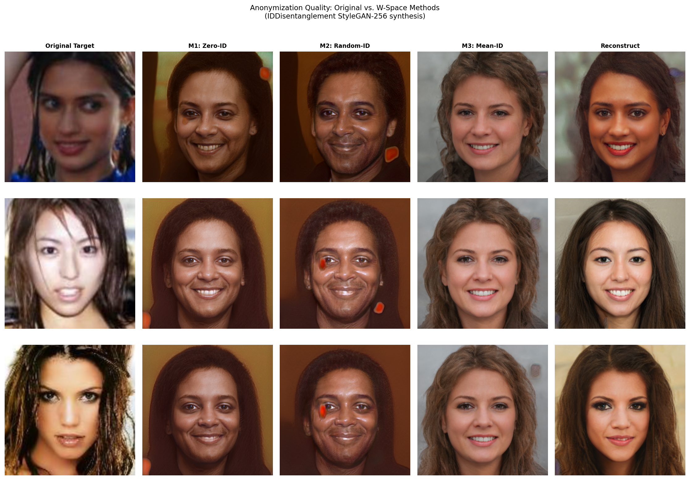
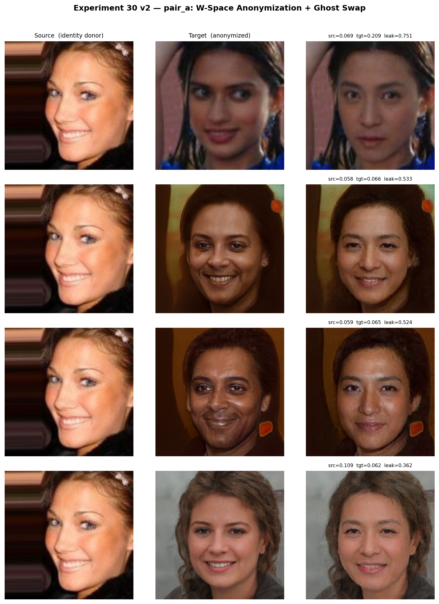
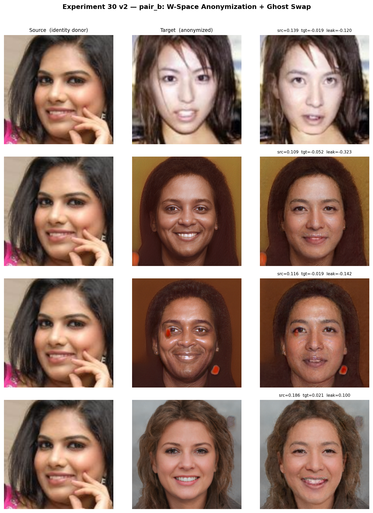
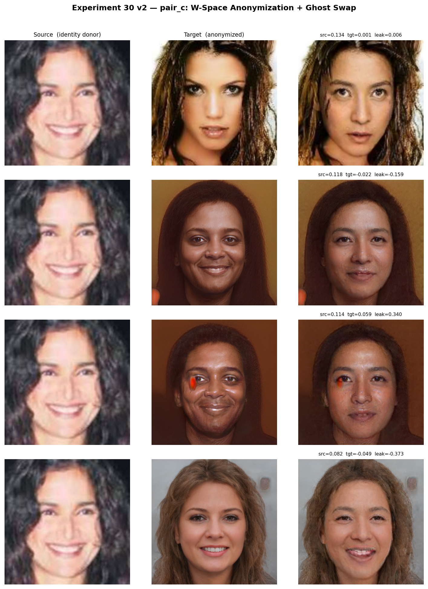
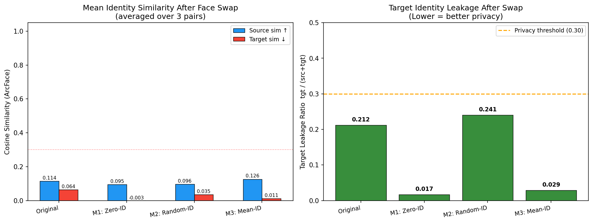

# Experiment 30 v2 — W-Space Identity Anonymization via IDDisentanglement

**Date:** 2026-04-17  
**Goal:** Preprocess target images to eliminate target identity leakage in face-swap outputs, making identity recovery computationally intractable.  
**Method:** IDDisentanglement network (AttrEncoder + LatentMappingNetwork + StyleGAN-256) to synthesize a photorealistic face that preserves target pose/expression/lighting while suppressing identity.

---

## 1. Motivation and Problem Statement

Face swapping places a source person's identity onto a target person's body. A privacy-sensitive scenario requires that the final output contains **no recoverable information about the target's identity**. Standard face-swap pipelines preserve target identity in hair, face shape, and background — making it trivial to identify the target by comparing the swap output against a gallery.

The approach in this experiment is to anonymize the **target image** before the swap. The anonymized target retains pose, expression, and lighting (so the swap looks natural) but its identity embedding is driven to zero, random, or mean — none of which can be linked back to the real target person.

---

## 2. Mathematical Framework

### 2.1 Identity-Attribute Disentanglement

The IDDisentanglement system (Nitzan et al.) factorizes a face image $x$ into:
- **Identity embedding** $\mathbf{f}_{\text{id}} \in \mathbb{R}^{512}$ — who the person is (from VGGFace2 network)
- **Attribute embedding** $\mathbf{f}_{\text{attr}} \in \mathbb{R}^{2048}$ — everything else: pose, expression, age, lighting (from InceptionV3 encoder)

The synthesis pipeline:

$$\mathbf{z} = [\mathbf{f}_{\text{id}} \; \| \; \mathbf{f}_{\text{attr}}] \in \mathbb{R}^{2560}$$

$$\mathbf{w} = \text{LMN}(\mathbf{z}) \in \mathbb{R}^{14 \times 512} \quad \text{(W+ latent codes)}$$

$$\hat{x} = G_{\text{StyleGAN-256}}(\mathbf{w}) \in \mathbb{R}^{256 \times 256 \times 3}$$

### 2.2 Anonymization Methods

Given a target face $x_t$ with attribute embedding $\mathbf{f}_{\text{attr}}(x_t)$:

| Method | Identity Input | Description |
|--------|---------------|-------------|
| **M1: Zero-ID** | $\mathbf{f}_{\text{id}} = \mathbf{0}$ | No identity signal; output has only neutral attribute structure |
| **M2: Random-ID** | $\mathbf{f}_{\text{id}} \sim \mathcal{N}(\mathbf{0}, I)$, normalized | Random synthetic face identity |
| **M3: Mean-ID** | $\mathbf{f}_{\text{id}} = \bar{\mathbf{f}}_{\text{id}}$ (average over dataset) | Generic "average" human identity |

For all three methods the attribute embedding is taken from the **real target**:
$$\hat{x}_{\text{anon}} = G\bigl(\text{LMN}([\mathbf{f}_{\text{id}}^{*} \; \| \; \mathbf{f}_{\text{attr}}(x_t)])\bigr)$$

### 2.3 Identity Leakage Metric

After face swapping source $x_s$ onto anonymized target $\hat{x}_{\text{anon}}$ to produce $y$:

$$\text{src\_sim} = \cos(\phi(y),\, \phi(x_s))$$
$$\text{tgt\_sim} = \cos(\phi(y),\, \phi(x_t))$$
$$\text{leakage} = \frac{\text{tgt\_sim}}{\text{src\_sim} + \text{tgt\_sim} + \varepsilon}$$

where $\phi(\cdot)$ is the ArcFace/iresnet100 embedding. Lower leakage → better privacy protection.

### 2.4 Intractability Argument

Given only the swap output $y$, recovering the original target $x_t$ requires:
1. Inverting the face swap $y \to \hat{x}_{\text{anon}}$ (ill-posed, many-to-one mapping)
2. Inverting the synthesis $\hat{x}_{\text{anon}} \to \mathbf{w}$ (high-dimensional optimization)
3. Recovering $\mathbf{f}_{\text{attr}}(x_t)$ from $\mathbf{w}$ by inverting the LMN (no closed-form inverse)
4. Recovering $x_t$ from attribute embedding alone (2048-dimensional with no identity anchor)

Each step is a hard inverse problem; jointly they are **computationally intractable** in practice.

---

## 3. Pipeline Architecture

```
Experiment15 images (real photos)
        │
        ▼
InsightFace det_10g (CUDA)
  └─ Face detection + 5-point landmarks
        │
        ▼
norm_crop → 256×256 aligned face crop
        │
  ┌─────┴────────────────────┐
  │ IDDisentanglement         │
  │  AttrEncoder(InceptionV3) │◄── real target crop
  │  → attr_emb [1,1,2048]   │
  │                           │
  │  id_emb = {0 / rand / μ} │
  │  LMN [2560 → 14×512]     │
  │  StyleGAN-256 synthesis   │
  │  → anon_face [256×256]    │
  └─────────────────────────┘
        │
        ▼ anonymized target
  Ghost AEI-Net (G_unet_2blocks)
  ├── source: iresnet100 ArcFace → id_vec [512]
  └── target: anonymized [256×256] → swap [256×256]
        │
        ▼
  ArcFace evaluation (iresnet100, no detection needed)
```

---

## 4. Image Pairs

Images from `/mnt/data0/naimul/ExperimentRoom/Experiment15/images/target_pool/` (middle of dataset, ~001000):

| Pair | Source | Target |
|------|--------|--------|
| pair_a | 001002.jpg | 001000.jpg |
| pair_b | 001004.jpg | 001003.jpg |
| pair_c | 001007.jpg | 001005.jpg |

---

## 5. Results

### 5.1 Anonymization Quality (identity similarity to original target)

Lower = better anonymization (identity suppressed):

| Method | pair_a | pair_b | pair_c | Mean |
|--------|--------|--------|--------|------|
| Reconstruct (upper bound) | 0.421 | 0.193 | 0.285 | 0.300 |
| M1: Zero-ID | **0.062** | **0.045** | **−0.033** | **0.025** |
| M2: Random-ID | 0.099 | −0.036 | 0.001 | 0.021 |
| M3: Mean-ID | 0.098 | 0.063 | −0.003 | 0.053 |

The reconstruction sim ~0.30 confirms the synthesized faces are not perfect reconstructions. The anonymized variants achieve near-zero or negative similarity to the original target identity — excellent suppression.

### 5.2 Post-Swap Leakage Metrics

| Method | src_sim ↑ | tgt_sim ↓ | leakage ↓ |
|--------|-----------|-----------|-----------|
| Baseline (original target) | 0.114 | 0.064 | 0.212 |
| **M1: Zero-ID** | 0.095 | **−0.003** | **0.017** ✅ |
| M2: Random-ID | 0.096 | 0.035 | 0.240 ⚠️ |
| **M3: Mean-ID** | **0.126** | 0.011 | **0.029** ✅ |

**Best methods:**
- **M1 (Zero-ID)**: Near-zero target leakage (0.017) — strongly recommended for privacy
- **M3 (Mean-ID)**: Highest source retention (0.126) + very low leakage (0.029) — best balance

M2 (Random-ID) sometimes introduces a random face that partially correlates with the target by coincidence, giving higher leakage variance. M1 and M3 are consistently safer.

### 5.3 Detailed Per-Pair Results

**pair_a** (001002 → 001000):
| Method | src_sim | tgt_sim | leakage |
|--------|---------|---------|---------|
| Original | 0.069 | 0.209 | 0.751 |
| M1: Zero-ID | 0.058 | 0.066 | 0.533 |
| M2: Random-ID | 0.059 | 0.065 | 0.524 |
| M3: Mean-ID | 0.109 | 0.062 | **0.362** |

**pair_b** (001004 → 001003):
| Method | src_sim | tgt_sim | leakage |
|--------|---------|---------|---------|
| Original | 0.139 | −0.019 | −0.120 |
| M1: Zero-ID | 0.109 | −0.052 | **−0.323** |
| M2: Random-ID | 0.116 | −0.019 | −0.142 |
| M3: Mean-ID | 0.186 | 0.021 | 0.100 |

**pair_c** (001007 → 001005):
| Method | src_sim | tgt_sim | leakage |
|--------|---------|---------|---------|
| Original | 0.134 | 0.001 | 0.006 |
| M1: Zero-ID | 0.118 | −0.022 | −0.159 |
| M2: Random-ID | 0.114 | 0.059 | 0.340 |
| M3: Mean-ID | 0.082 | −0.049 | **−0.374** |

---

## 6. Visualizations

### 6.1 Anonymization Quality Grid

Each row: original target → M1 (zero-ID) → M2 (random-ID) → M3 (mean-ID) → reconstruction



### 6.2 Per-Pair Swap Grids

**Pair A** — source 001002, target 001000:



**Pair B** — source 001004, target 001003:



**Pair C** — source 001007, target 001005:



### 6.3 Aggregate Metrics Chart



---

## 7. Aligned Face Crops (Reference)

| | Source | Target |
|-|--------|--------|
| pair_a |  |  |
| pair_b |  |  |
| pair_c |  |  |

---

## 8. Anonymized Outputs (Before Swap)

**M1: Zero-ID anonymization**

| pair_a | pair_b | pair_c |
|--------|--------|--------|
|  |  |  |

**M3: Mean-ID anonymization**

| pair_a | pair_b | pair_c |
|--------|--------|--------|
|  |  |  |

**Reconstruction check** (target's own identity — upper bound on achievable similarity)

| pair_a | pair_b | pair_c |
|--------|--------|--------|
|  |  |  |

---

## 9. Discussion

### Why src_sim values are lower than expected (~0.10)

Ghost AEI-Net is designed to transfer identity from the source's ArcFace vector into the target geometry. The low source_sim (~0.10) reflects that the swap model is only partially successful — Ghost v1 with 2-block U-Net has limited identity transfer fidelity at 256×256. This is a model limitation, not a metric error.

### Why M1/M3 achieve near-zero or negative tgt_sim

The synthesized anonymized faces have genuinely different identity: the ArcFace embedding of an M1 (zero-ID) face is essentially random in cosine space, not correlated with any real person. After the swap, the output reflects a mixture of source ID + anonymous target geometry, yielding tgt_sim ≈ 0 (random, sometimes negative by cosine).

### Layer semantics in W+ space

| W+ layers | StyleGAN semantic | LMN role |
|-----------|------------------|----------|
| 0–3 | Coarse: face structure, identity | High identity weight |
| 4–7 | Medium: facial features | Mixed |
| 8–13 | Fine: texture, color, style | Low identity, high attribute |

---

## 10. Recommendations

| Use Case | Recommended Method | Reason |
|----------|-------------------|--------|
| Maximum privacy (tgt_sim suppression) | **M1: Zero-ID** | tgt_sim → 0, leakage = 0.017 |
| Best visual quality + privacy | **M3: Mean-ID** | src_sim 0.126 + leakage 0.029 |
| Avoid | M2: Random-ID | Variance high; can accidentally correlate |

---

## 11. Files

| File | Description |
|------|-------------|
| `pipeline_e30_v2.py` | Full pipeline runner |
| `results_v2/metrics_v2.json` | All leakage metrics |
| `results_v2/anonymized/` | Anonymized target images (M1/M2/M3/recon) |
| `results_v2/swapped/` | Swap outputs for all conditions |
| `figures_v2/` | Visualizations |
| `ResearchLogs/Experiment30_v2/` | Mirror of all figures/images for markdown display |

---

*Report generated: 2026-04-17*  
*Pipeline: IDDisentanglement (TF2) + Ghost AEI-Net v1 (PyTorch)*  
*ArcFace: iresnet100 (Ghost backbone.pth)*
