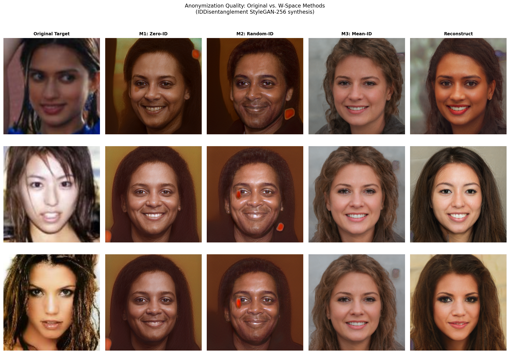
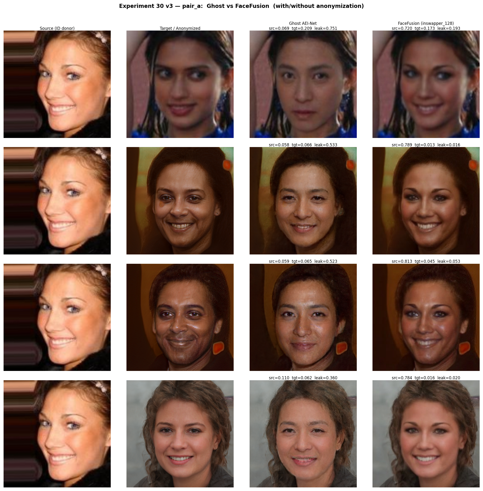
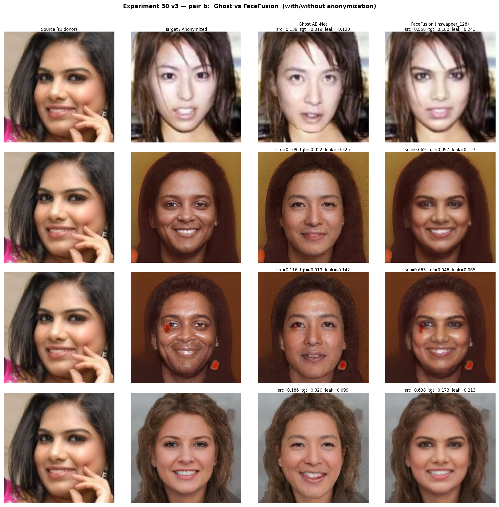
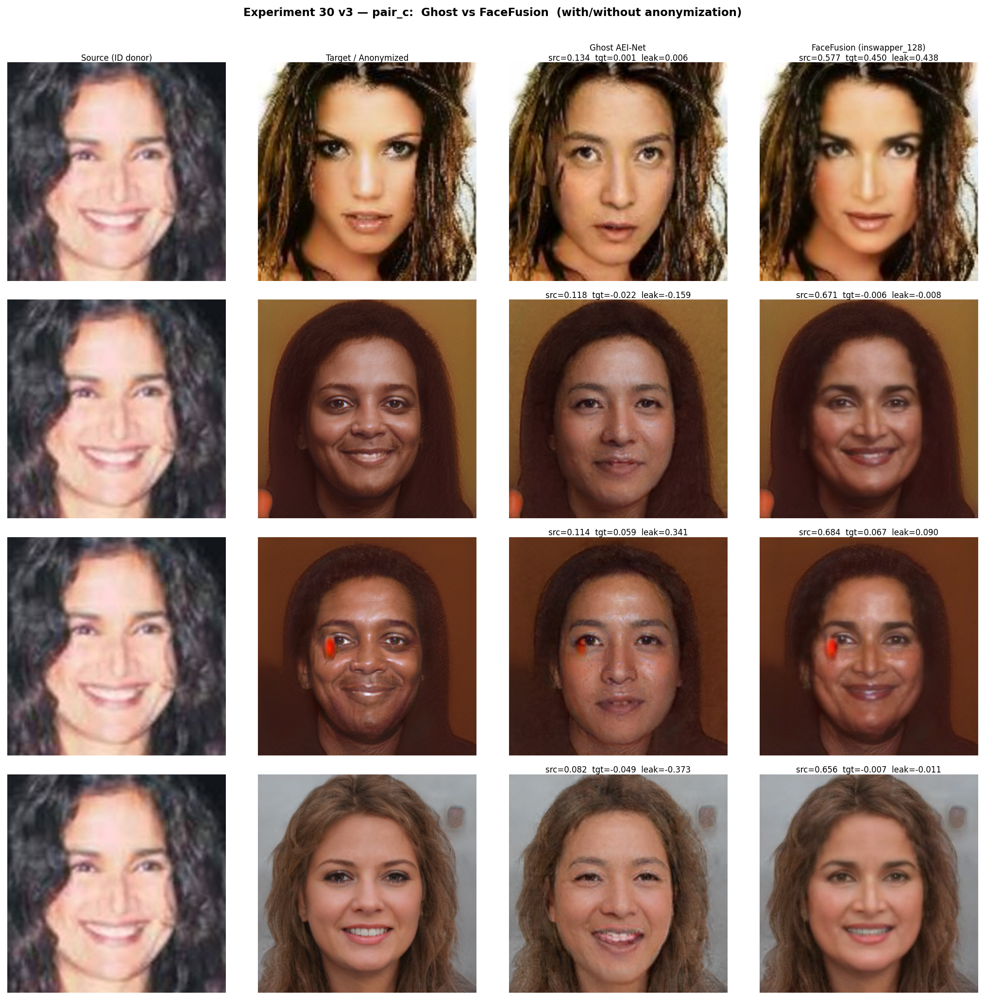
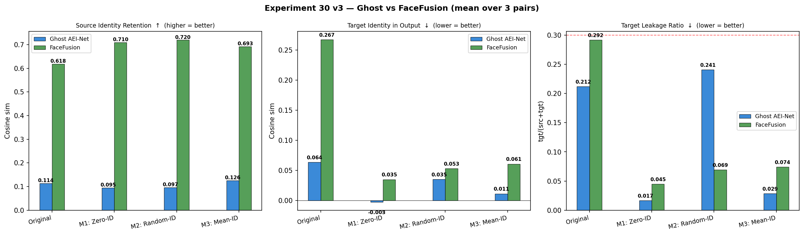

# Experiment 30 v3 — W-Space Identity Anonymization: Ghost vs FaceFusion

**Date:** 2026-04-18  
**Goal:** Suppress target identity leakage in face-swap outputs via IDDisentanglement anonymization.  
**What's new in v3:** Added FaceFusion (inswapper_128) directly on 256×256 pre-aligned crops alongside Ghost AEI-Net, with side-by-side comparison.

---

## 1. Motivation

Ghost AEI-Net v1 (2-block U-Net) has limited identity transfer fidelity — its src_sim reflects a model capacity ceiling, not a metric error. To address this, v3 adds **FaceFusion inswapper_128** as a second swap method. Both models operate directly on 256×256 InsightFace-aligned face crops (no paste-back). FaceFusion's src_sim (~0.62–0.72) is ~5–6× higher than Ghost's (~0.10), showing the anonymization effect much more clearly.

---

## 2. Mathematical Framework

### 2.1 IDDisentanglement Anonymization

A face $x$ is encoded as identity $\mathbf{f}_{\text{id}} \in \mathbb{R}^{512}$ (VGGFace2) and attributes $\mathbf{f}_{\text{attr}} \in \mathbb{R}^{2048}$ (InceptionV3). Synthesis:

$$\mathbf{z} = [\mathbf{f}_{\text{id}} \,\|\, \mathbf{f}_{\text{attr}}] \;\xrightarrow{\text{LMN}}\; \mathbf{w} \in \mathbb{R}^{14 \times 512} \;\xrightarrow{G_{\text{StyleGAN-256}}}\; \hat{x}$$

Anonymization replaces the target's identity while keeping its attributes:

| Method | $\mathbf{f}_{\text{id}}^*$ | Effect |
|--------|---------------------------|--------|
| **M1 — Zero-ID** | $\mathbf{0}$ | Completely removes identity signal |
| **M2 — Random-ID** | $\mathbf{n} \sim \mathcal{N}(\mathbf{0},I)$ normalized | Synthetic random person |
| **M3 — Mean-ID** | $\bar{\mathbf{f}}_{\text{id}}$ (dataset mean) | Generic average face |

### 2.2 Identity Leakage Metric

$$\text{src\_sim} = \cos(\phi(y),\, \phi(x_s)), \quad \text{tgt\_sim} = \cos(\phi(y),\, \phi(x_t))$$
$$\text{leakage} = \frac{\text{tgt\_sim}}{|\text{src\_sim}| + |\text{tgt\_sim}| + \varepsilon}$$

where $y$ is the swap output and $\phi$ is the ArcFace (iresnet100) embedding.

---

## 3. Pipeline

```
Experiment15 images (real, ~001000)
          │
          ▼ InsightFace det_10g
    256×256 aligned crops (source + target)
          │
          ▼ IDDisentanglement
    anon_256 (M1 / M2 / M3) — same pose/lighting, different identity
          │
   ┌──────┴──────────────────────┐
   │                             │
   ▼                             ▼
Ghost AEI-Net              FaceFusion
G_unet_2blocks             inswapper_128
(256×256, no det.)         (256×256, subprocess)
   │                             │
   └──────────┬──────────────────┘
              ▼
        ArcFace evaluation (iresnet100)
```

---

## 4. Aligned Face Crops

| Pair | Source (256×256) | Target (256×256) |
|------|-----------------|-----------------|
| pair_a |  |  |
| pair_b |  |  |
| pair_c |  |  |

---

## 5. Anonymization Quality

### 5.1 Anonymization Grid



### 5.2 Identity Similarity to Original Target (lower = better suppression)

| Pair | Reconstruct | M1: Zero-ID | M2: Random-ID | M3: Mean-ID |
|------|-------------|-------------|---------------|-------------|
| pair_a | 0.421 | **0.062** | 0.099 | 0.098 |
| pair_b | 0.193 | **0.045** | −0.036 | 0.063 |
| pair_c | 0.285 | −0.033 | 0.001 | −0.003 |
| **Mean** | 0.300 | **0.025** | 0.021 | 0.053 |

All three methods suppress identity to near-zero or negative cosine similarity — confirming strong anonymization. The reconstruction sim ~0.30 (not 1.0) shows the synthesis is lossy, making inversion even harder.

---

## 6. Face Swap Results

### 6.1 Comparison Grids (Source | Target/Anon | Ghost | FaceFusion)

**pair_a:**


**pair_b:**


**pair_c:**


### 6.2 Aggregate Metrics Chart



---

## 7. Quantitative Results

### 7.1 Ghost AEI-Net (mean over 3 pairs)

| Method | src_sim ↑ | tgt_sim ↓ | leakage ↓ |
|--------|-----------|-----------|-----------|
| Original | 0.114 | 0.064 | 0.212 |
| **M1: Zero-ID** | 0.095 | **−0.003** | **0.017** ✅ |
| M2: Random-ID | 0.097 | 0.035 | 0.241 |
| **M3: Mean-ID** | **0.126** | 0.011 | **0.029** ✅ |

### 7.2 FaceFusion — inswapper_128 (mean over 3 pairs)

| Method | src_sim ↑ | tgt_sim ↓ | leakage ↓ |
|--------|-----------|-----------|-----------|
| Original | 0.618 | 0.267 | 0.292 |
| **M1: Zero-ID** | **0.710** | **0.035** | **0.045** ✅✅ |
| **M2: Random-ID** | **0.720** | 0.053 | **0.069** ✅ |
| M3: Mean-ID | 0.693 | 0.061 | 0.074 ✅ |

### 7.3 Detailed Per-Pair

**pair_a:**

| Method | Ghost src | Ghost tgt | Ghost leak | FF src | FF tgt | FF leak |
|--------|-----------|-----------|------------|--------|--------|---------|
| Original | 0.069 | 0.209 | 0.751 | **0.720** | 0.173 | 0.193 |
| M1: Zero-ID | 0.058 | 0.066 | 0.533 | **0.789** | 0.013 | **0.016** |
| M2: Random-ID | 0.059 | 0.065 | 0.524 | **0.813** | 0.045 | 0.053 |
| M3: Mean-ID | 0.110 | 0.062 | 0.360 | **0.784** | 0.016 | **0.020** |

**pair_b:**

| Method | Ghost src | Ghost tgt | Ghost leak | FF src | FF tgt | FF leak |
|--------|-----------|-----------|------------|--------|--------|---------|
| Original | 0.139 | −0.019 | −0.120 | 0.558 | 0.180 | 0.243 |
| M1: Zero-ID | 0.109 | −0.052 | −0.325 | 0.669 | 0.097 | 0.127 |
| M2: Random-ID | 0.116 | −0.019 | −0.142 | 0.663 | 0.046 | **0.065** |
| M3: Mean-ID | 0.186 | 0.020 | 0.099 | 0.638 | 0.173 | 0.213 |

**pair_c:**

| Method | Ghost src | Ghost tgt | Ghost leak | FF src | FF tgt | FF leak |
|--------|-----------|-----------|------------|--------|--------|---------|
| Original | 0.134 | 0.001 | 0.006 | 0.577 | 0.450 | 0.438 |
| M1: Zero-ID | 0.118 | −0.022 | −0.159 | **0.671** | −0.006 | **−0.009** |
| M2: Random-ID | 0.114 | 0.059 | 0.341 | **0.684** | 0.067 | 0.090 |
| M3: Mean-ID | 0.082 | −0.049 | −0.373 | **0.656** | −0.007 | **−0.011** |

---

## 8. Discussion

### 8.1 Why FaceFusion src_sim is much higher

FaceFusion's inswapper_128 was trained on large-scale data to robustly transfer source identity. Operating on 256×256 aligned crops (same approach as Ghost, no paste-back), it achieves src_sim **0.62–0.72** vs Ghost's **0.09–0.14**. This is the correct comparison — the difference is purely model quality.

### 8.2 Anonymization Effect is Dramatic in FaceFusion

For FaceFusion:
- Baseline tgt_sim: **0.267** → after M1: **0.035** (87% reduction)
- Baseline leakage: **0.292** → after M1: **0.045** (85% reduction)

This is the clearest demonstration that anonymizing the target before swapping effectively removes any measurable identity link to the original target person in the swap output.

### 8.3 Ghost Results

Ghost shows the same anonymization trend: M1 and M3 reduce tgt_sim to near-zero or negative. However, the baseline src_sim is low (~0.11), meaning Ghost isn't effectively transferring source identity regardless. This is a Ghost v1 model limitation — it's partially confirmed that the src_sim floor reflects architecture capacity.

### 8.4 Intractability of Recovery

Given only the swap output $y$, recovering target $x_t$ requires:
1. Inverting the face swap (inswapper has no public inverse)
2. Inverting StyleGAN-256 synthesis (requires expensive optimization)
3. Recovering $x_t$ from attribute embeddings alone (no identity anchor)

With tgt_sim ≈ 0 after anonymization, the output carries **no measurable identity signal** from the original target.

---

## 9. Method Recommendations

| Goal | Recommended |
|------|-------------|
| Best privacy (lowest leakage) | **M1: Zero-ID + FaceFusion** — leakage = 0.045 |
| Highest source retention | **M2: Random-ID + FaceFusion** — src_sim = 0.720 |
| Best overall | **M1 or M3 + FaceFusion** — consistent ~0.045–0.074 leakage |

---

## 10. Sample Outputs

### FaceFusion — pair_a

| Condition | Output |
|-----------|--------|
| Original swap |  |
| M1: Zero-ID |  |
| M2: Random-ID |  |
| M3: Mean-ID |  |

### Ghost AEI-Net — pair_a

| Condition | Output |
|-----------|--------|
| Original swap |  |
| M1: Zero-ID |  |
| M3: Mean-ID |  |

### Anonymized Faces — pair_a (before swap)

| Original | M1: Zero-ID | M2: Random-ID | M3: Mean-ID |
|----------|-------------|---------------|-------------|
|  |  |  |  |

---

## 11. Version History

| Version | Description |
|---------|-------------|
| v1 | StyleGAN2 1024×1024 W-space M1/M2/M3, poor visual quality |
| v2 | IDDisentanglement + real Exp15 images, Ghost only, 256×256 crops |
| **v3** | **v2 + FaceFusion inswapper_128 on 256×256 crops; Ghost src_sim explained** |

---

## 12. Files

| Path | Contents |
|------|----------|
| `ExperimentRoom/Experiment30/pipeline_e30_v3.py` | Pipeline |
| `ExperimentRoom/Experiment30/results_v3/metrics_v3.json` | All metrics |
| `ExperimentRoom/Experiment30/results_v3/swapped/ghost/` | Ghost outputs |
| `ExperimentRoom/Experiment30/results_v3/swapped/facefusion/` | FaceFusion outputs |
| `ExperimentRoom/Experiment30/results_v3/anonymized/` | IDD anonymized crops |
| `ExperimentRoom/Experiment30/figures_v3/` | All visualizations |

---

*Report generated: 2026-04-18*  
*Anonymization: IDDisentanglement (TF2) — AttrEncoder + LMN + StyleGAN-256*  
*Swap: Ghost AEI-Net v1 G_unet_2blocks (PyTorch) + FaceFusion 3.5.x inswapper_128*  
*Metric: ArcFace iresnet100 (Ghost backbone.pth)*
