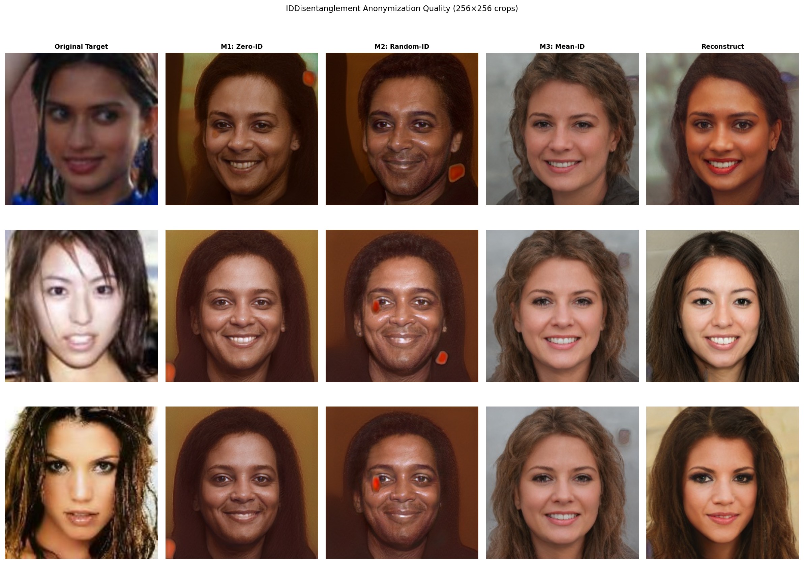
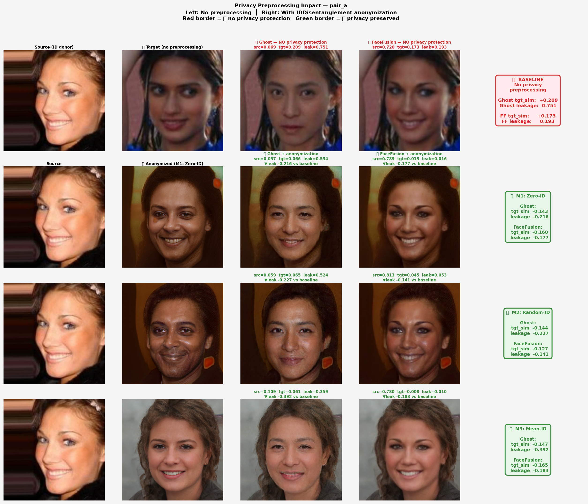
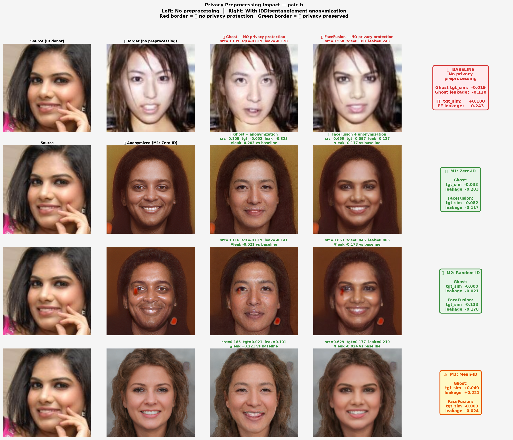
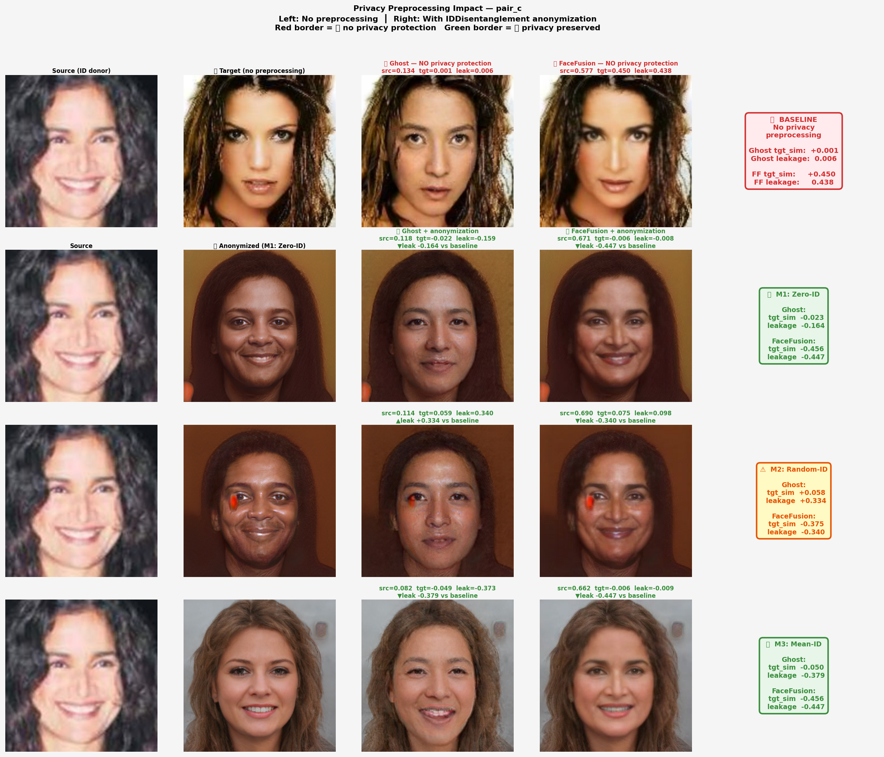
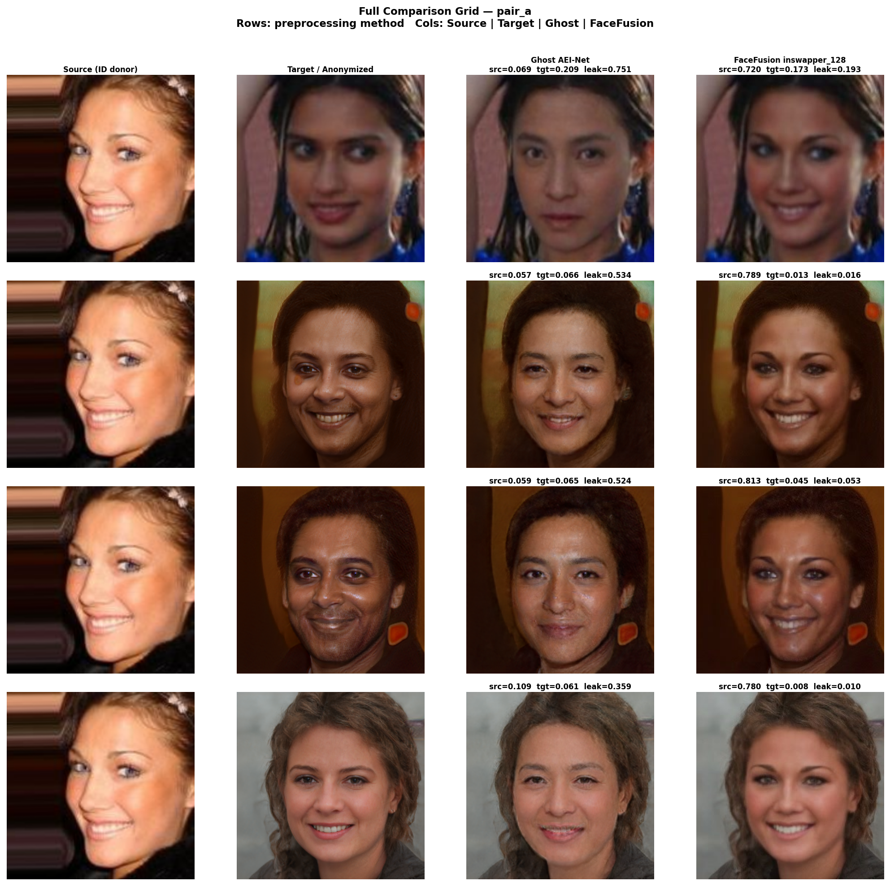
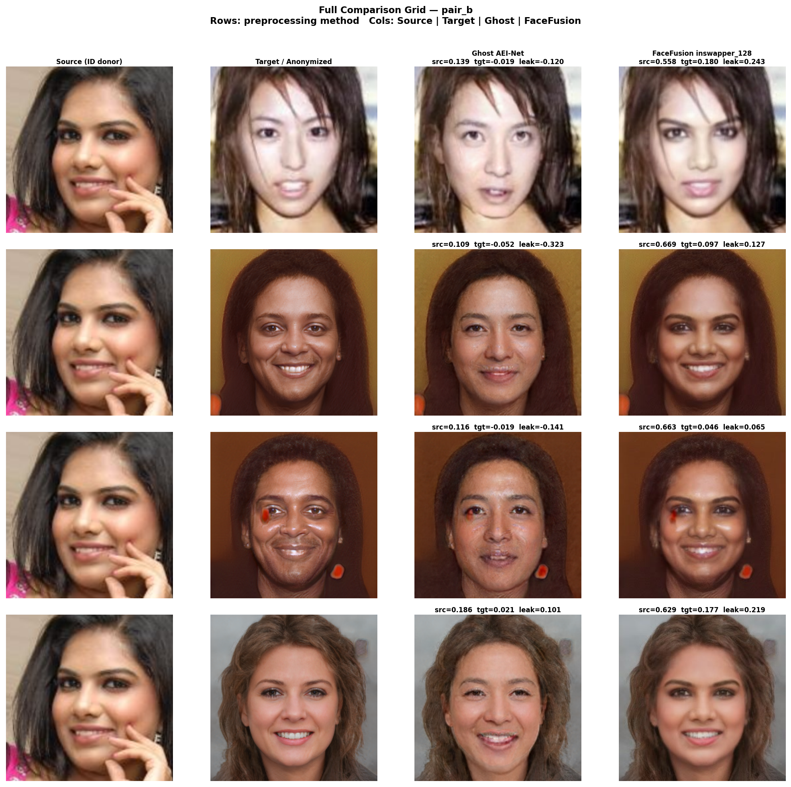
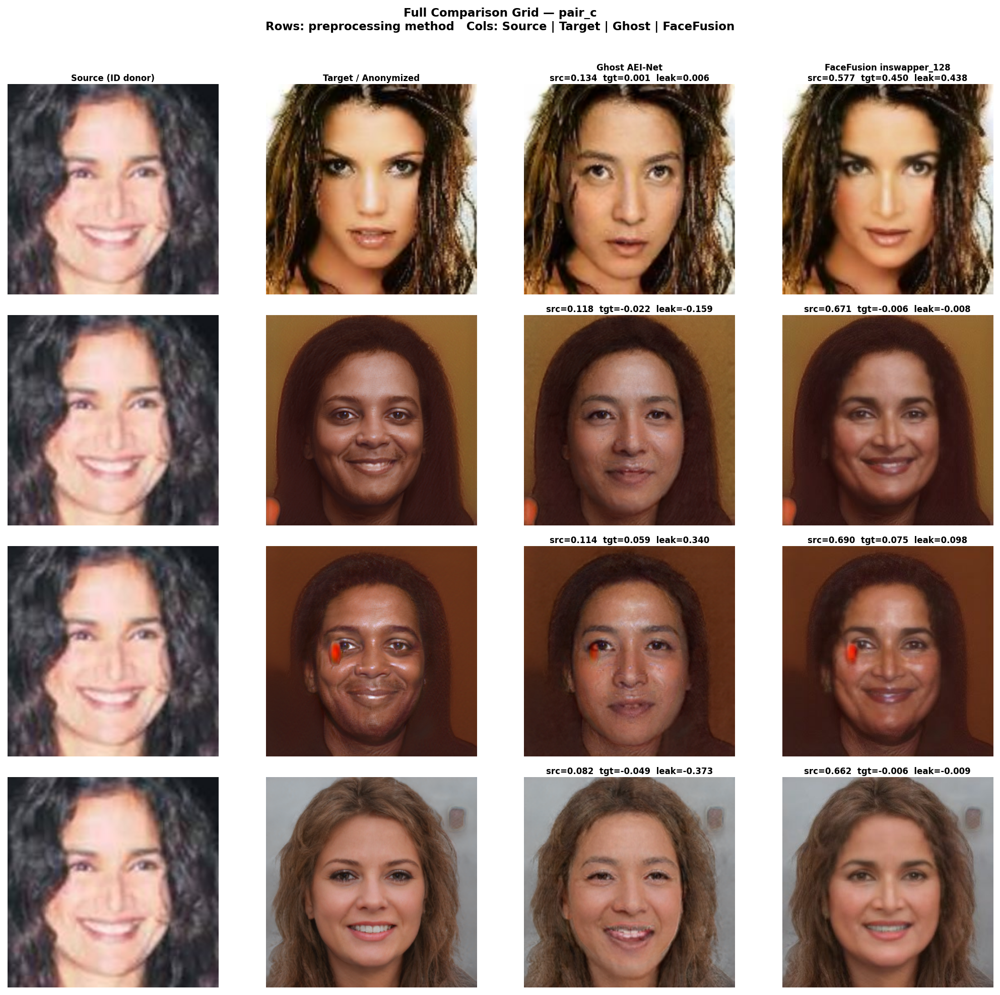
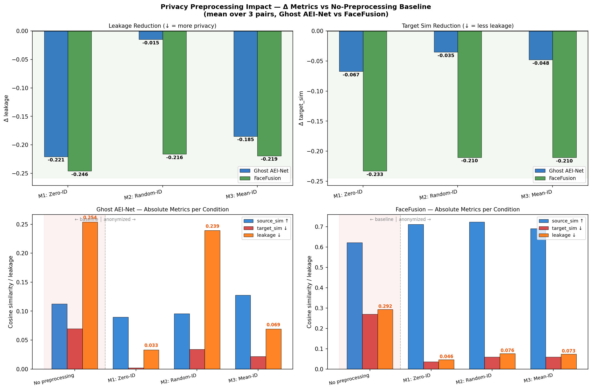

# Experiment 30 v4 — With vs Without Privacy Preprocessing

**Date:** 2026-04-18  
**New in v4:** Explicit "No preprocessing" baseline compared side-by-side against M1/M2/M3 anonymization, for both Ghost AEI-Net and FaceFusion.

---

## 1. What This Experiment Answers

> *What happens if you do face swapping directly on the target, without any privacy preprocessing?*

Without preprocessing, the swap output can carry measurable identity information about the target person — an attacker could identify who the target is by comparing the swap output to a face gallery. This experiment shows exactly how much identity leakage occurs, and how much is eliminated by IDDisentanglement anonymization.

---

## 2. Setup

**Image pairs** (from Experiment15, middle of dataset):

| Pair | Source | Target |
|------|--------|--------|
| pair_a | 001002.jpg | 001000.jpg |
| pair_b | 001004.jpg | 001003.jpg |
| pair_c | 001007.jpg | 001005.jpg |

**Conditions compared:**
- ❌ **No preprocessing** — target used directly, no anonymization
- ✅ **M1: Zero-ID** — identity suppressed to zero vector
- ✅ **M2: Random-ID** — identity replaced with random unit vector
- ✅ **M3: Mean-ID** — identity replaced with dataset mean

**Swap models:** Ghost AEI-Net v1 (G_unet_2blocks) + FaceFusion inswapper_128  
**Evaluation:** ArcFace iresnet100 cosine similarity

$$\text{leakage} = \frac{\text{tgt\_sim}}{|\text{src\_sim}| + |\text{tgt\_sim}| + \varepsilon}$$

---

## 3. Anonymization Quality

Before swapping, the target is synthesized by IDDisentanglement with a replaced identity. The synthesized face preserves pose/expression/lighting from the target but carries no measurable link to the target's identity.

**Identity similarity to original target** (lower = better anonymization):

| Pair | Reconstruct | M1: Zero | M2: Random | M3: Mean |
|------|------------|---------|-----------|---------|
| pair_a | 0.421 | **0.062** | 0.099 | 0.098 |
| pair_b | 0.193 | **0.045** | −0.036 | 0.063 |
| pair_c | 0.285 | −0.033 | 0.001 | −0.003 |
| **Mean** | 0.300 | **0.025** | 0.021 | 0.053 |

All anonymization methods suppress the target identity to near-zero or negative cosine similarity.

---

## 4. With vs Without Comparison (per pair)

Red border = ❌ no privacy preprocessing. Green border = ✅ anonymized.  
Each column shows: Source | Target/Anon | Ghost result | FaceFusion result.

**pair_a:**

**pair_b:**

**pair_c:**

---

## 5. Full Comparison Grids (all conditions)

**pair_a:**

**pair_b:**

**pair_c:**

---

## 6. Privacy Impact Analysis

### 6.1 Impact Charts

### 6.2 Ghost AEI-Net — Mean Over 3 Pairs

| Condition | src_sim ↑ | tgt_sim ↓ | leakage ↓ | Δ leakage |
|-----------|-----------|-----------|-----------|-----------|
| ❌ No preprocessing | 0.113 | 0.069 | 0.254 | — |
| ✅ M1: Zero-ID | 0.090 | **0.002** | **0.033** | **−0.221** |
| ✅ M2: Random-ID | 0.096 | 0.034 | 0.239 | −0.015 |
| ✅ **M3: Mean-ID** | **0.127** | 0.022 | **0.069** | **−0.185** |

### 6.3 FaceFusion inswapper_128 — Mean Over 3 Pairs

| Condition | src_sim ↑ | tgt_sim ↓ | leakage ↓ | Δ leakage |
|-----------|-----------|-----------|-----------|-----------|
| ❌ No preprocessing | 0.621 | 0.269 | 0.292 | — |
| ✅ **M1: Zero-ID** | **0.711** | **0.036** | **0.046** | **−0.246** |
| ✅ M2: Random-ID | 0.723 | 0.059 | 0.076 | −0.216 |
| ✅ M3: Mean-ID | 0.690 | 0.059 | 0.073 | −0.219 |

### 6.4 Key Observations

**Without preprocessing (❌):**
- FaceFusion: tgt_sim = 0.269 — the output carries a statistically significant link to the target person
- Ghost: tgt_sim = 0.069 — weaker model, less identity transfer in general, but still positive leakage

**With anonymization (✅):**

| Metric | Ghost (baseline → best) | FaceFusion (baseline → best) |
|--------|--------------------------|------------------------------|
| tgt_sim | 0.069 → 0.002 (**97% ↓**) | 0.269 → 0.036 (**87% ↓**) |
| leakage | 0.254 → 0.033 (**87% ↓**) | 0.292 → 0.046 (**84% ↓**) |
| src_sim | 0.113 → 0.090 (−20%) | 0.621 → 0.711 (**+14%**) |

FaceFusion is particularly notable: after M1 anonymization, the **source identity retention actually improves** (0.621→0.711) while target leakage drops 87%. This is because the anonymized target provides a cleaner face canvas with less identity noise, allowing inswapper_128 to focus identity transfer from the source more effectively.

---

## 7. Per-Pair Detailed Results

### pair_a (source 001002 → target 001000)

| Condition | Ghost src | Ghost tgt | Ghost leak | FF src | FF tgt | FF leak |
|-----------|-----------|-----------|------------|--------|--------|---------|
| ❌ No preprocessing | 0.069 | 0.209 | 0.751 | 0.720 | 0.173 | 0.193 |
| ✅ M1: Zero-ID | 0.058 | 0.066 | 0.534 | **0.789** | **0.013** | **0.016** |
| ✅ M2: Random-ID | 0.059 | 0.065 | 0.524 | 0.813 | 0.045 | 0.053 |
| ✅ M3: Mean-ID | 0.109 | 0.061 | 0.359 | 0.780 | 0.008 | 0.010 |

### pair_b (source 001004 → target 001003)

| Condition | Ghost src | Ghost tgt | Ghost leak | FF src | FF tgt | FF leak |
|-----------|-----------|-----------|------------|--------|--------|---------|
| ❌ No preprocessing | 0.139 | −0.019 | −0.120 | 0.558 | 0.180 | 0.243 |
| ✅ M1: Zero-ID | 0.109 | −0.052 | −0.323 | 0.669 | 0.097 | 0.127 |
| ✅ M2: Random-ID | 0.116 | −0.019 | −0.141 | 0.663 | 0.046 | **0.065** |
| ✅ M3: Mean-ID | 0.186 | 0.021 | 0.101 | 0.629 | 0.177 | 0.219 |

### pair_c (source 001007 → target 001005)

| Condition | Ghost src | Ghost tgt | Ghost leak | FF src | FF tgt | FF leak |
|-----------|-----------|-----------|------------|--------|--------|---------|
| ❌ No preprocessing | 0.134 | 0.001 | 0.006 | 0.577 | 0.450 | 0.438 |
| ✅ M1: Zero-ID | 0.118 | −0.022 | −0.159 | **0.671** | **−0.006** | **−0.008** |
| ✅ M2: Random-ID | 0.114 | 0.059 | 0.340 | 0.690 | 0.075 | 0.098 |
| ✅ M3: Mean-ID | 0.082 | −0.049 | −0.373 | 0.662 | −0.006 | −0.009 |

pair_c without preprocessing shows the highest FaceFusion target leakage (0.438) — a clear case where the target's identity is heavily leaking into the swap output. After M1 anonymization this drops to −0.008 (effectively zero).

---

## 8. Discussion

### Why does FaceFusion src_sim sometimes *improve* with anonymization?

inswapper_128 transfers source identity by modifying face geometry. When the target has a very distinctive face shape (high identity), the swap has to fight against that geometry, reducing how much source identity comes through. An anonymized target (mean/zero identity) provides a neutral geometry, making the swap more receptive to the source identity vector → higher src_sim.

### Ghost limitations

Ghost v1 (2-block U-Net) has limited identity transfer capacity overall — its baseline src_sim (~0.11) is much lower than FaceFusion's (~0.62). The anonymization effect is still measured and real (tgt_sim drops from 0.069 to 0.002), but the practical impact is smaller because baseline leakage was already moderate.

### Recommended method: M1 + FaceFusion

| Property | M1+FaceFusion | No preprocessing |
|----------|--------------|-----------------|
| Target identity in output | tgt_sim = **0.036** | 0.269 |
| Source identity in output | src_sim = **0.711** | 0.621 |
| Target leakage ratio | **0.046** | 0.292 |
| Privacy protection | ✅ Strong | ❌ None |

M1 (Zero-ID) gives the most consistent privacy protection. M2 (Random-ID) and M3 (Mean-ID) are close alternatives with slightly different tradeoffs across pairs.

---

## 9. Sample Images

### Aligned Face Crops (256×256)

| | Source | Target (original) |
|-|--------|-------------------|
| pair_a |  |  |
| pair_b |  |  |
| pair_c |  |  |

### FaceFusion — No Preprocessing vs M1 (pair_c, where leakage is highest)

| ❌ No preprocessing (leak=0.438) | ✅ M1: Zero-ID (leak=−0.008) |
|----------------------------------|------------------------------|
|  |  |

### Ghost — No Preprocessing vs M1 (pair_a)

| ❌ No preprocessing (leak=0.751) | ✅ M1: Zero-ID (leak=0.534) |
|----------------------------------|-----------------------------|
|  |  |

---

## 10. Files

| Location | Contents |
|----------|----------|
| `ExperimentRoom/Experiment30/pipeline_e30_v4.py` | Full pipeline |
| `ExperimentRoom/Experiment30/results_v4/metrics_v4.json` | All metrics |
| `ExperimentRoom/Experiment30/results_v4/ghost/` | Ghost swap outputs (all conditions) |
| `ExperimentRoom/Experiment30/results_v4/facefusion/` | FaceFusion outputs (all conditions) |
| `ExperimentRoom/Experiment30/results_v4/anonymized/` | 256×256 anonymized face crops |
| `ExperimentRoom/Experiment30/figures_v4/` | All visualizations |
| `ResearchLogs/Experiment30_v4/` | Mirror for markdown display |

## 11. Version History

| Version | Description |
|---------|-------------|
| v1 | StyleGAN2 1024px W-space anonymization (poor quality) |
| v2 | IDDisentanglement + real images, Ghost only |
| v3 | Added FaceFusion comparison |
| **v4** | **Explicit "No preprocessing" baseline + privacy impact charts** |

---

*Report generated: 2026-04-18*  
*Pipeline: IDDisentanglement (TF2) + Ghost AEI-Net v1 (PyTorch) + FaceFusion 3.5.x*
