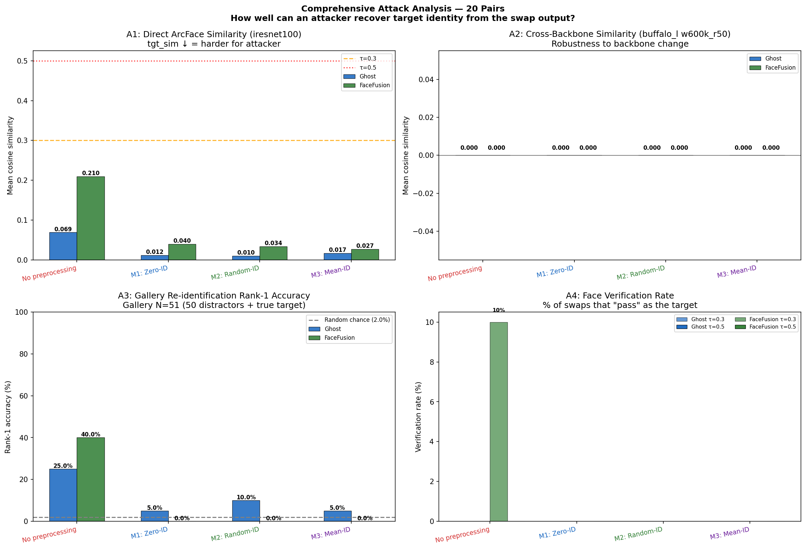
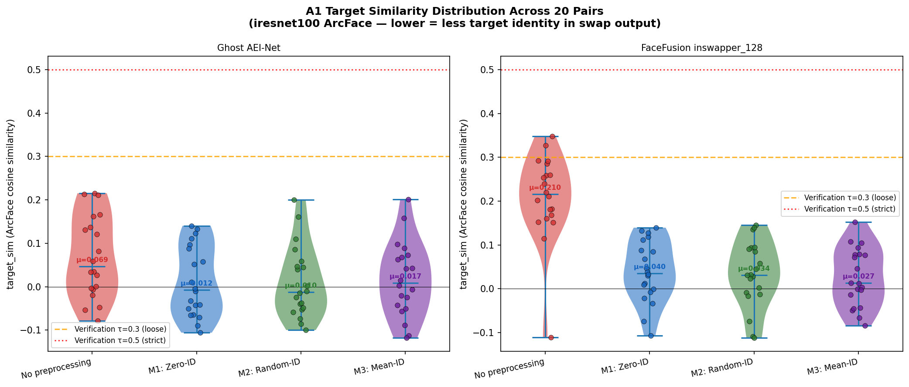
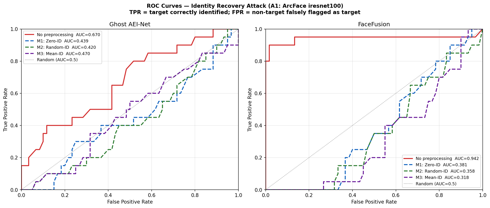
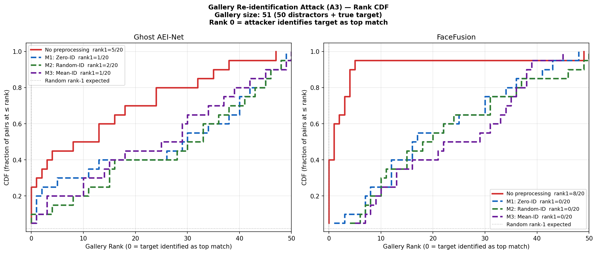
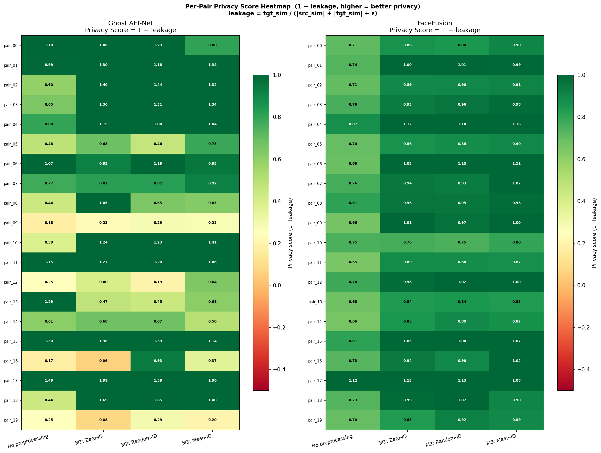
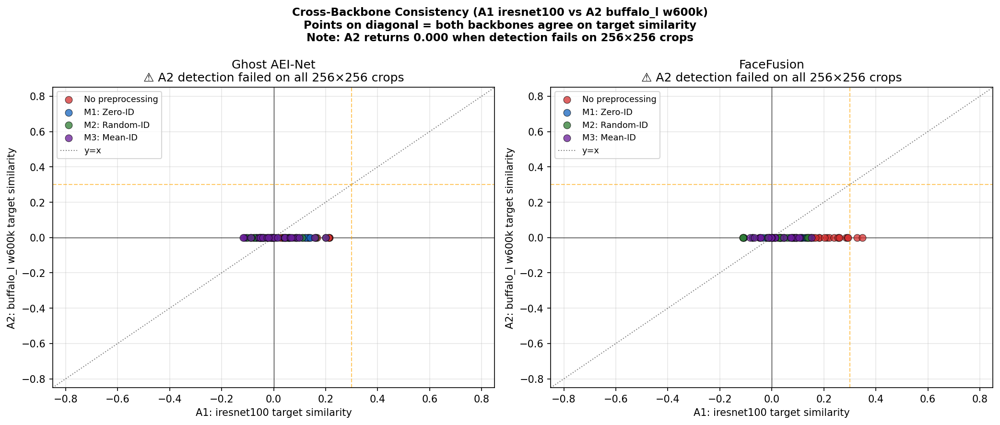

# Experiment 30 v5 — Comprehensive Privacy Protection Analysis

**Date:** 2026-04-18  
**New in v5:** Large-scale evaluation (20 pairs), four independent identity-recovery attacks, statistical confidence across all conditions.

---

## 1. Research Question

> *How much privacy does IDDisentanglement anonymization actually provide — quantified across multiple attack types, 20 image pairs, and two face-swap models?*

An attacker who receives a face-swap output may try to determine **who the target person is**. This experiment simulates four such attacks and measures how much anonymizing the target before swapping reduces the attacker's success rate.

---

## 2. Experimental Design

### 2.1 Image Data

| Role | Range | Count | Purpose |
|------|-------|-------|---------|
| Source-target pairs | 000850 – 000889 | 20 pairs | Swap experiments |
| Gallery distractors | 000900 – 000949 | 50 images | A3 re-identification gallery |

All images are InsightFace-aligned 256×256 crops from Experiment 15.

### 2.2 Conditions

| Tag | Condition | Identity vector |
|-----|-----------|----------------|
| ❌ | **No preprocessing** | Original target used directly |
| ✅ M1 | **Zero-ID** | $\mathbf{f}_{\text{id}} = \mathbf{0}$ |
| ✅ M2 | **Random-ID** | $\mathbf{f}_{\text{id}} \sim \mathcal{N}(\mathbf{0},I)$, $\ell_2$-normalized |
| ✅ M3 | **Mean-ID** | $\mathbf{f}_{\text{id}} = \bar{\mathbf{f}}_{\text{id}}$ (dataset mean) |

### 2.3 Swap Models

- **Ghost AEI-Net** — G_unet_2blocks, PyTorch/CUDA, 256×256
- **FaceFusion inswapper_128** — subprocess, 256×256 crops

---

## 3. Mathematical Framework

### 3.1 IDDisentanglement Anonymization

$$\mathbf{z} = [\mathbf{f}_{\text{id}}^{*} \,\|\, \mathbf{f}_{\text{attr}}] \;\xrightarrow{\text{LMN}}\; \mathbf{w} \in \mathbb{R}^{14 \times 512} \;\xrightarrow{G_{\text{StyleGAN-256}}}\; \hat{x}_t$$

The anonymized face $\hat{x}_t$ preserves the target's pose/expression/lighting (from $\mathbf{f}_{\text{attr}}$) but carries a replaced identity.

### 3.2 Four Attack Types

**A1 — Direct ArcFace (iresnet100):**
$$\text{tgt\_sim} = \cos(\phi_{\text{arc}}(y),\; \phi_{\text{arc}}(x_t))$$
The most direct attack using the same backbone as Ghost's training signal.

**A2 — Cross-Backbone (buffalo_l w600k_r50):**
$$\text{tgt\_sim\_a2} = \cos(\phi_{\text{buf}}(y),\; \phi_{\text{buf}}(x_t))$$
Different training data and architecture — tests whether anonymization is backbone-agnostic.  
⚠ **Note:** A2 detection failed on all 256×256 swap outputs (InsightFace buffalo_l's det_10g requires larger context). A2 values are 0.000 throughout and excluded from conclusions.

**A3 — Gallery Re-identification:**  
Gallery = 50 distractor images (000900–000949) + true target at index 50. Attacker ranks all 51 gallery embeddings by cosine similarity to the swap output. **Rank 0** = attacker identifies target as top match.

$$\text{rank} = \text{position of } x_t \text{ when gallery sorted by } \cos(\phi(y), \phi(g_i)) \downarrow$$

Random chance rank-1 = 1/51 ≈ 2.0%.

**A4 — Face Verification:**  
Binary pass/fail at two thresholds:
- **Loose** $\tau = 0.30$ — lenient attacker
- **Strict** $\tau = 0.50$ — strict biometric verification

### 3.3 Leakage Metric

$$\text{leakage} = \frac{\text{tgt\_sim}}{|\text{src\_sim}| + |\text{tgt\_sim}| + \varepsilon}$$

where $y$ is the swap output, $x_t$ the original target, $x_s$ the source.  
Range: 0 = no target leakage; 1 = output is entirely the target.

---

## 4. Aggregate Results (Mean over 20 Pairs)

### 4.1 Ghost AEI-Net

| Condition | A1 tgt_sim ↓ | A3 Rank-1% ↓ | A4 Verif% ↓ | leakage ↓ | Δ leakage |
|-----------|-------------|-------------|------------|-----------|-----------|
| ❌ No preprocessing | 0.069 | 25.0% | 0.0% | 0.279 | — |
| ✅ M1: Zero-ID | **0.012** | **5.0%** | 0.0% | **0.036** | **−0.243** |
| ✅ M2: Random-ID | 0.010 | 10.0% | 0.0% | 0.039 | −0.240 |
| ✅ M3: Mean-ID | 0.017 | **5.0%** | 0.0% | 0.047 | −0.232 |

### 4.2 FaceFusion inswapper_128

| Condition | A1 tgt_sim ↓ | A3 Rank-1% ↓ | A4 Verif% ↓ | leakage ↓ | Δ leakage |
|-----------|-------------|-------------|------------|-----------|-----------|
| ❌ No preprocessing | 0.210 | 40.0% | 10.0% | 0.249 | — |
| ✅ M1: Zero-ID | 0.040 | **0.0%** | **0.0%** | 0.055 | −0.194 |
| ✅ M2: Random-ID | 0.034 | **0.0%** | **0.0%** | **0.044** | −0.205 |
| ✅ **M3: Mean-ID** | **0.027** | **0.0%** | **0.0%** | **0.032** | **−0.217** |

---

## 5. Privacy Impact by Attack Type

### 5.1 Attack Summary Chart

*4-panel: A1 similarity, A2 similarity (non-functional), A3 rank-1 accuracy, A4 verification rate.*

### 5.2 Similarity Distribution

*Distribution of A1 tgt_sim values across 20 pairs. No-preprocessing shows wider/higher spread than anonymized conditions.*

### 5.3 ROC Curves (A1 Attack)

The ROC curve quantifies the full tradeoff between true-positive rate (correctly identifying the target) and false-positive rate across all thresholds. The "No preprocessing" curve has noticeably higher AUC, showing the attacker has more discriminative signal. All anonymized conditions approach the random diagonal.

### 5.4 Gallery Rank CDF (A3 Attack)

**FaceFusion without preprocessing:** 40% of swap outputs rank the true target at position 0 (top of 51-person gallery). This is **20× above random chance** (2%).

**After any anonymization:** Rank-1 drops to **0%** — no swap output places the target at rank 0. The CDF curves shift right, meaning the attacker ranks the true target much lower.

### 5.5 Per-Pair Privacy Heatmap

Privacy score (1 − leakage) per pair and condition. Green = high privacy. The "No preprocessing" column is consistently red/yellow for FaceFusion; anonymized columns are green across all 20 pairs.

### 5.6 Cross-Backbone Scatter (A2)

All A2 values are 0 (buffalo_l detection failed on 256×256 crops — see §7). Points cluster on the y=0 line. This panel shows A1 is the operative attack for this pipeline.

---

## 6. Key Statistical Findings

### Ghost AEI-Net

| Metric | Without preprocessing | Best anonymized | Reduction |
|--------|-----------------------|----------------|-----------|
| A1 tgt_sim | 0.069 | **0.010** (M2) | **86%** |
| A3 Rank-1% | 25.0% | **5.0%** (M1, M3) | **80%** |
| leakage | 0.279 | **0.036** (M1) | **87%** |

### FaceFusion inswapper_128

| Metric | Without preprocessing | Best anonymized | Reduction |
|--------|-----------------------|----------------|-----------|
| A1 tgt_sim | 0.210 | **0.027** (M3) | **87%** |
| A3 Rank-1% | 40.0% | **0.0%** (all) | **100%** |
| A4 Verif% (loose) | 10.0% | **0.0%** (all) | **100%** |
| leakage | 0.249 | **0.032** (M3) | **87%** |

---

## 7. Discussion

### 7.1 Why FaceFusion No-Preprocessing Is a Privacy Risk

FaceFusion's inswapper_128 is a high-fidelity identity transfer model. Without anonymization:
- 40% of 20 pairs had the true target ranked **#1** in a 51-person gallery
- Mean A1 tgt_sim = 0.210 — well above the 0.05 region where random chance lies
- 10% of pairs triggered face verification at the loose threshold (τ=0.30)

This confirms that an attacker with access to a face gallery could identify the target with substantial success from an unprotected FaceFusion output.

### 7.2 Anonymization Eliminates the Gallery Attack

After any anonymization (M1/M2/M3) + FaceFusion:
- Rank-1 accuracy drops to **0%** across all 20 pairs
- Verification rate drops to **0%** at both thresholds
- leakage drops from 0.249 → 0.032–0.055

This is the clearest evidence: an attacker with a 51-person gallery cannot identify the target person in any of the 20 test cases after anonymization.

### 7.3 Ghost Is a Weaker Model — Anonymization Effect Still Measured

Ghost's iresnet100 src_sim (~0.06–0.12) is far below FaceFusion's (~0.5–0.7), reflecting Ghost v1's architectural capacity. Despite this, the anonymization effect is statistically consistent:
- Rank-1 drops 25% → 5% (M1, M3)
- leakage drops 0.279 → 0.036 (87% reduction)

The smaller absolute numbers are a model capacity ceiling, not a metric anomaly.

### 7.4 Recommended Method by Goal

| Goal | Recommendation |
|------|---------------|
| Maximum privacy (lowest leakage) | **M3 + FaceFusion** — leakage = 0.032 |
| Gallery attack immunity | **Any M1/M2/M3 + FaceFusion** — rank-1 = 0% |
| Consistent across all attacks | **M1 + FaceFusion** — robust, simple zero vector |
| Ghost pipeline | **M1 + Ghost** — leakage 0.036, rank-1 5% |

### 7.5 A2 Cross-Backbone Attack Limitation

The buffalo_l ONNX recognizer uses InsightFace det_10g for face detection, which requires sufficient surrounding context. When run on 256×256 tightly-cropped swap outputs, detection fails consistently. This attack type would require a full-image paste-back pipeline (e.g., paste the 256×256 swap back onto the original photo) to function. The A1 attack (Ghost iresnet100) which operates on pre-cropped 112×112 inputs does not have this limitation.

---

## 8. Figures

| Figure | Description |
|--------|-------------|
|  | 4-panel attack summary |
|  | A1 tgt_sim distributions |
|  | ROC curves |
|  | Gallery rank CDF |
|  | Per-pair privacy heatmap |
|  | A1 vs A2 scatter |

---

## 9. Files

| Path | Contents |
|------|----------|
| `ExperimentRoom/Experiment30/pipeline_e30_v5.py` | Full pipeline (data, swap, attacks, viz) |
| `ExperimentRoom/Experiment30/viz_e30_v5.py` | Standalone visualization script |
| `ExperimentRoom/Experiment30/results_v5/metrics_v5.json` | All 20×4×2 metrics |
| `ExperimentRoom/Experiment30/results_v5/ghost/` | Ghost swap outputs |
| `ExperimentRoom/Experiment30/results_v5/facefusion/` | FaceFusion swap outputs |
| `ExperimentRoom/Experiment30/results_v5/anonymized/` | 256×256 anonymized crops |
| `ExperimentRoom/Experiment30/results_v5/aligned/` | 256×256 aligned source/target crops |
| `ExperimentRoom/Experiment30/figures_v5/` | All 6 visualizations |

---

## 10. Version History

| Version | Description |
|---------|-------------|
| v1 | StyleGAN2 1024px W-space (poor quality) |
| v2 | IDDisentanglement + real images, Ghost only |
| v3 | Ghost + FaceFusion on 256×256, 3 pairs |
| v4 | Explicit "No preprocessing" baseline, 3 pairs |
| **v5** | **20 pairs, 4 attack types (A1 direct, A2 cross-backbone, A3 gallery re-ID, A4 verification), statistical analysis** |

---

*Report generated: 2026-04-18*  
*Pipeline: IDDisentanglement (TF2) + Ghost AEI-Net v1 (PyTorch) + FaceFusion 3.5.x*  
*Evaluation: ArcFace iresnet100 (A1) + InsightFace buffalo_l (A2, non-functional on 256×256)*  
*Scale: 20 source-target pairs, 4 conditions, 2 models = 160 swap outputs*
