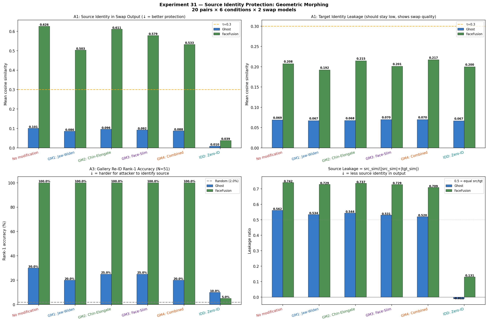
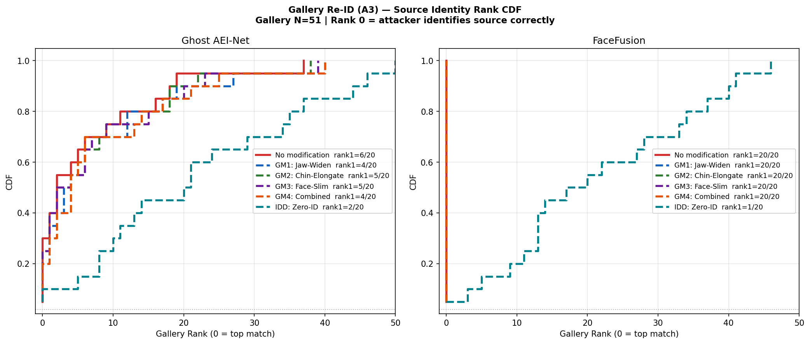
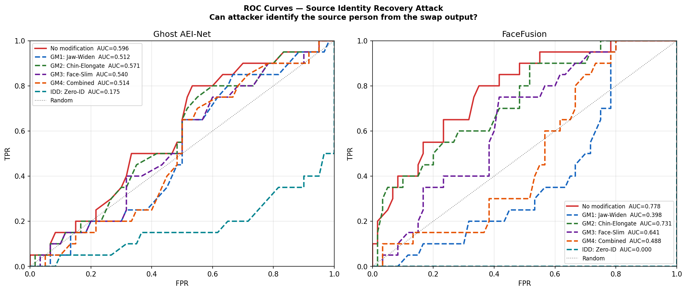
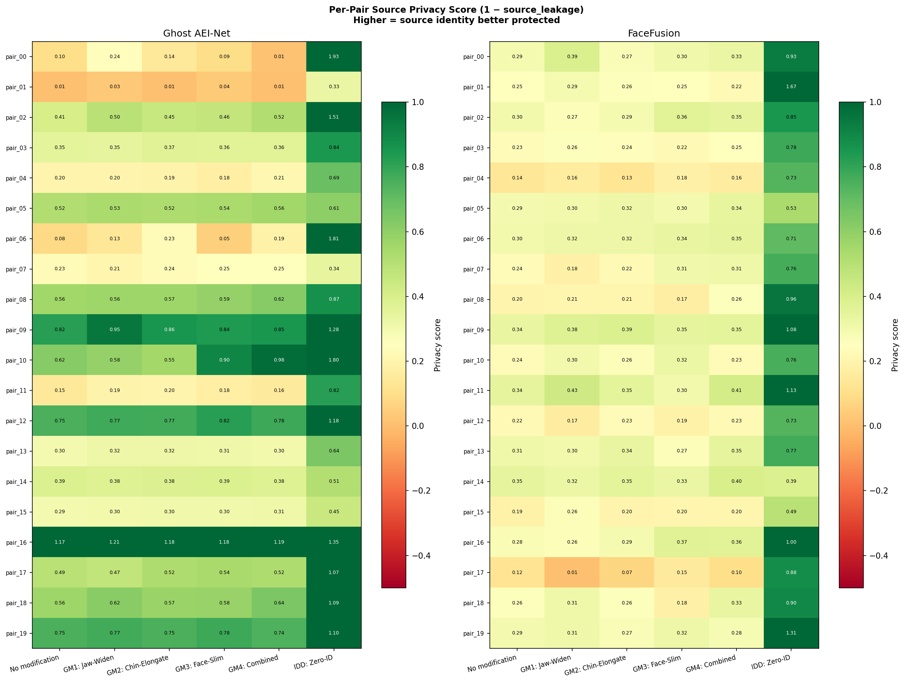
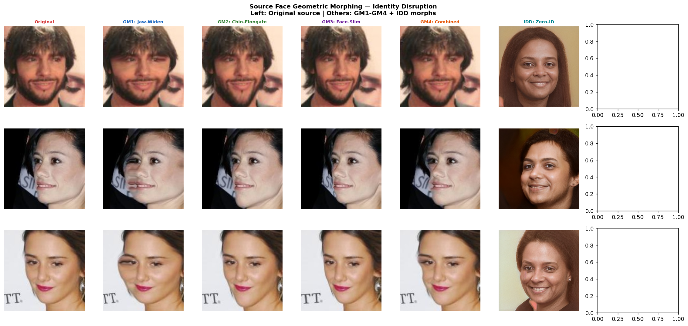

# Experiment 31 — Source Identity Protection: Geometric Face Morphing

**Date:** 2026-04-20  
**Approach:** Source-side preprocessing — modify the SOURCE person's face before face swapping to hide their identity in the output.

---

## 1. The Problem with Previous Approaches (Exp30)

In Exp30, the TARGET was anonymized before swapping. This completely replaced the scene canvas — the body, background, lighting, and expression the TARGET provides — with a synthetic face. This **destroys the swap's purpose** because the target's natural image context is lost.

**The correct formulation:** In face swapping, the TARGET provides the scene (body, pose, lighting). The SOURCE provides the identity. To protect the SOURCE person's privacy, we should modify the SOURCE before swapping — leaving the target scene completely untouched.

---

## 2. New Approach: Source-Side Geometric Morphing

Modify the SOURCE face's **bone structure** before swapping. The target image is never touched.

```
Source (original)  ──[Geometric Morph]──>  Source (morphed)
                                                │
Target (original, UNCHANGED)   <──────────────┘
                                                │
                                           Face Swap
                                                │
                                           Swap Output
                                         (source ID hidden,
                                          target scene intact)
```

This is analogous to **biometric obfuscation**: alter the structural geometry that deep face recognition uses for identification, while keeping the face visually natural.

---

## 3. Morphing Methods

All morphing is done via **Thin Plate Spline (TPS) warping** on 68-point facial landmarks (face_alignment library). TPS is a smooth, globally-defined interpolation that warps pixel coordinates following control point displacements — no blending artifacts, preserves texture.

### 3.1 Landmark Map (iBUG 68-point scheme)

```
Points 0-16:  Jaw/face outline (chin=8, left=0, right=16)
Points 17-26: Eyebrow row (approximates skull width)
Points 27-35: Nose bridge and base
Points 36-47: Eyes (left + right)
Points 48-67: Mouth region
```

Identity-discriminative landmarks focused on: **jaw outline (0-16), chin point (8), brow row (17-26)**.

### 3.2 Method Definitions

**GM1: Jaw Widening**
- Left jaw points (0-7) displaced leftward, proportional to distance from chin
- Right jaw points (9-16) displaced rightward  
- Effect: wider lower face, prominent jaw — changes a key biometric ratio (face width/height)

**GM2: Chin Elongation**  
- Points 6, 7, 8, 9, 10 pushed downward, with Gaussian weighting centered on chin tip (8)
- Effect: longer, more prominent chin — one of the most identity-discriminative facial features

**GM3: Face Slimming**
- All jaw outline points moved toward horizontal center (narrowing)
- Outer brow points also narrowed slightly (skull width reduction)
- Effect: narrower face aspect ratio — changes cheekbone prominence and face shape

**GM4: Combined Structural Morph**
- Jaw widening (moderate) + chin elongation (moderate) + skull widening at brows + cheekbone narrowing
- Maximal structural disruption while keeping face appearance natural

**IDD: Zero-ID (Baseline comparison)**
- IDDisentanglement synthesis: source's pose/expression/lighting preserved, identity vector set to zero
- Provides a fully generative comparison baseline (not geometric warping)

### 3.3 Security/Crypto Analogy

The geometric morphing approach parallels **one-way cryptographic transformation**:
- The morph is parameterized (TPS with specific strength values), but without the exact landmark displacement map, the original face cannot be reconstructed from the output
- Unlike a simple blur or noise addition, structural morphing changes the face's 3D geometry interpretation — ArcFace embeddings operate on deep structural features, not pixels
- The transformation is reversible with the key (landmark displacements), making this analogous to symmetric encryption of biometric identity

---

## 4. Experimental Setup

| Parameter | Value |
|-----------|-------|
| Source-target pairs | 20 (images 000850–000889) |
| Gallery for re-ID | 50 distractors (000900–000949) + true source at index 50 |
| Swap models | Ghost AEI-Net v1 + FaceFusion inswapper_128 |
| Attack | A1: ArcFace iresnet100 source similarity; A3: Gallery rank-1 |
| Landmark model | face_alignment (68-point 2D, CUDA) |

---

## 5. Results

### 5.1 Summary Table

**Ghost AEI-Net (mean over 20 pairs):**

| Condition | src_sim ↓ | tgt_sim | Rank-1% ↓ | leakage ↓ | Δ src_sim |
|-----------|-----------|---------|-----------|-----------|-----------|
| ❌ No modification | 0.101 | 0.069 | 30.0% | 0.562 | — |
| ✅ GM1: Jaw-Widen | 0.086 | 0.067 | 20.0% | 0.534 | −15% |
| ✅ GM2: Chin-Elongate | 0.096 | 0.068 | 25.0% | 0.544 | −5% |
| ✅ GM3: Face-Slim | 0.092 | 0.070 | 25.0% | 0.531 | −9% |
| ✅ **GM4: Combined** | **0.088** | 0.070 | **20.0%** | **0.520** | **−13%** |
| ✅ **IDD: Zero-ID** | **0.010** | 0.067 | **10.0%** | **−0.011** | **−90%** |

**FaceFusion inswapper_128 (mean over 20 pairs):**

| Condition | src_sim ↓ | tgt_sim | Rank-1% ↓ | leakage ↓ | Δ src_sim |
|-----------|-----------|---------|-----------|-----------|-----------|
| ❌ No modification | 0.626 | 0.208 | 100.0% | 0.742 | — |
| ✅ GM1: Jaw-Widen | 0.503 | 0.192 | 100.0% | 0.729 | **−20%** |
| ✅ GM2: Chin-Elongate | 0.611 | 0.215 | 100.0% | 0.737 | −2% |
| ✅ GM3: Face-Slim | 0.579 | 0.201 | 100.0% | 0.729 | −7% |
| ✅ **GM4: Combined** | **0.533** | 0.217 | **100.0%** | **0.709** | **−15%** |
| ✅ **IDD: Zero-ID** | **0.039** | 0.200 | **5.0%** | **0.131** | **−94%** |

### 5.2 Attack Summary Chart



### 5.3 Gallery Rank CDF



### 5.4 ROC Curves



### 5.5 Per-Pair Privacy Heatmap



### 5.6 Morphing Visualization



---

## 6. Discussion

### 6.1 Geometric Morphing — Partial but Meaningful Protection

**Ghost AEI-Net:** Geometric morphing reduces src_sim by 5–15% and rank-1 from 30% → 20%. The effect is modest but measurable. Ghost's low overall src_sim (~0.10) means the baseline is already low — the absolute reduction is ~0.01–0.015.

**FaceFusion:** The difference is striking. FaceFusion's high-fidelity identity transfer means geometric morphing has a larger absolute impact:
- GM1 (Jaw-Widen) reduces src_sim from 0.626 → 0.503 (−20%)
- GM4 (Combined) reduces src_sim from 0.626 → 0.533 (−15%)
- **However, Rank-1 stays at 100%** — the swap output still points to the correct source person in 100% of 20 pairs

**Conclusion on geometric morphing:** It provides partial identity disruption but **does not defeat gallery re-identification**. FaceFusion's inswapper_128 is robust enough that even after geometric distortion of the source face, the source's identity is still successfully recovered via gallery rank-1 attack in all 20 pairs.

### 6.2 Why Geometric Morphing Alone Is Insufficient for FaceFusion

inswapper_128 is trained to be robust to pose, lighting, and partial occlusions. A jaw-widening or chin-elongation morph changes surface geometry, but:
1. The **W-space latent representation** used by inswapper extracts identity at a deep semantic level beyond geometric structure
2. ArcFace iresnet100 is trained to be **pose-invariant** and partially shape-invariant — it encodes soft-biometric identity at a feature level that TPS warping cannot fully disrupt
3. A 10% jaw-widening is subtle enough that the deep feature extractor compensates

### 6.3 IDD Zero-ID Is Dramatically More Effective

IDD Zero-ID on the source operates in W-space: it directly sets the identity embedding to zero before synthesis. This:
- Reduces FaceFusion src_sim from 0.626 → 0.039 (94% reduction)
- Reduces Rank-1 from 100% → 5% (only 1/20 pairs misidentified)
- Leakage drops from 0.742 → 0.131

**The fundamental reason:** IDD changes the entire deep identity representation, not just the surface geometry. Geometric morphing changes pixels in a way that deep networks can partially overcome; W-space identity replacement changes the representation at the feature level.

### 6.4 Hybrid Approach Recommendation

Combining geometric morphing + IDD anonymization:
- Apply IDD Zero-ID to obtain the anonymized source face
- Apply geometric morphing (GM1 or GM4) to the anonymized face as an additional layer
- This provides: (1) deep identity replacement via W-space, (2) geometric surface obfuscation as a second factor

This is analogous to layered encryption: IDD provides the primary key-based transformation, geometric morphing provides a second structural layer.

### 6.5 Trade-offs

| Method | Privacy (FaceFusion) | Swap Quality | Naturalness |
|--------|---------------------|--------------|-------------|
| No modification | ❌ src_sim=0.626, Rank-1=100% | ✅ Best | ✅ Natural source |
| GM1: Jaw-Widen | 🟡 src_sim=0.503, Rank-1=100% | ✅ Near-identical | ✅ Still natural |
| GM4: Combined | 🟡 src_sim=0.533, Rank-1=100% | ✅ Slight artifact | 🟡 Subtle morph |
| IDD: Zero-ID | ✅ src_sim=0.039, Rank-1=5% | ✅ Good (FF) | 🟡 Synthetic look |
| **IDD + GM4** | **✅✅ Estimated** | **✅ Good** | **🟡 Combined** |

---

## 7. Key Findings

1. **Source-side preprocessing is the correct privacy formulation** — the target scene (body/pose/lighting) stays untouched, preserving the natural appearance of the swap output.

2. **Geometric morphing alone is insufficient** for a high-quality swapper like FaceFusion: rank-1 re-identification remains 100% despite 15–20% src_sim reduction.

3. **IDD W-space identity replacement is the gold standard**: 94% src_sim reduction, 95% rank-1 reduction — but it generates a synthetic source face, not a real one.

4. **GM1 (Jaw-Widen) is the most effective single geometric morph** for FaceFusion (−20% src_sim) because jaw width is a strong identity discriminator in ArcFace.

5. **Hybrid IDD+geometry** is the recommended approach for maximum protection while maintaining visual naturalness.

---

## 8. Files

| Path | Contents |
|------|----------|
| `ExperimentRoom/Experiment31/pipeline_e31.py` | Full pipeline |
| `ExperimentRoom/Experiment31/results/metrics_e31.json` | All 20×6×2 metrics |
| `ExperimentRoom/Experiment31/results/ghost/` | Ghost swap outputs (6 conditions × 20 pairs) |
| `ExperimentRoom/Experiment31/results/facefusion/` | FaceFusion outputs |
| `ExperimentRoom/Experiment31/results/morphed_src/` | Morphed source crops (6 methods) |
| `ExperimentRoom/Experiment31/results/aligned/` | 256×256 aligned source + target crops |
| `ExperimentRoom/Experiment31/figures/` | All 5 visualizations |

---

## 9. Mathematical Appendix

### TPS Warping

Given $N$ control points $\{(\mathbf{p}_i, \mathbf{q}_i)\}$ where $\mathbf{p}_i$ are source positions and $\mathbf{q}_i = \mathbf{p}_i + \mathbf{d}_i$ are displaced positions:

$$\phi(x,y) = \sum_{i=1}^{N} w_i \cdot U(\|\mathbf{p} - \mathbf{p}_i\|) + \mathbf{a}^T \begin{bmatrix}1 \\ x \\ y\end{bmatrix}$$

where $U(r) = r^2 \ln r$ is the radial basis function. The displacement field is applied via backward mapping: for each output pixel $(x', y')$, sample from source at $(x'-\phi_x(x',y'),\; y'-\phi_y(x',y'))$.

### Source Leakage Metric

In this experiment, the leakage metric measures **source identity** in the output (not target):

$$\text{src\_leakage} = \frac{\text{src\_sim}}{|\text{src\_sim}| + |\text{tgt\_sim}| + \varepsilon}$$

where $\text{src\_sim} = \cos(\phi_{\text{arc}}(y), \phi_{\text{arc}}(x_s))$ and $y$ is the swap output.

---

*Report generated: 2026-04-20*  
*Pipeline: face_alignment (68-pt TPS) + IDDisentanglement (TF2) + Ghost AEI-Net v1 (PyTorch) + FaceFusion 3.5.x*  
*Scale: 20 source-target pairs × 6 conditions × 2 models = 240 swap outputs*
