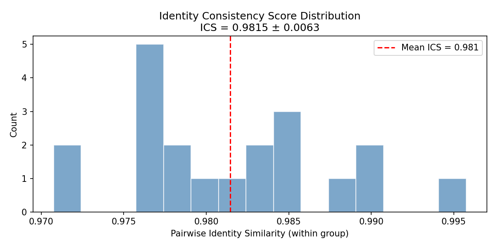
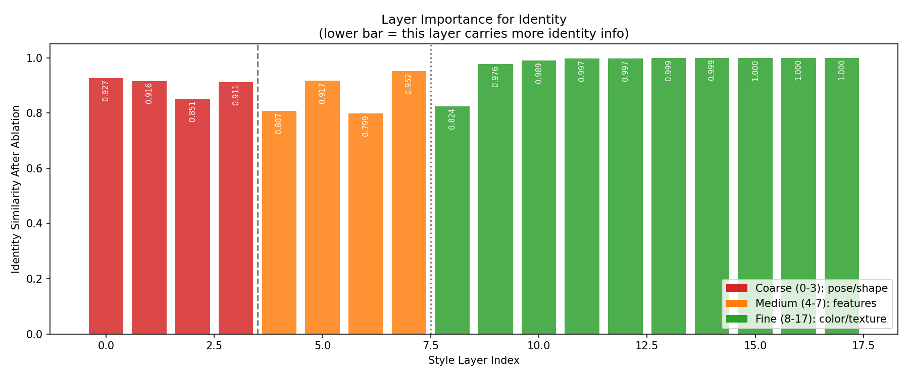
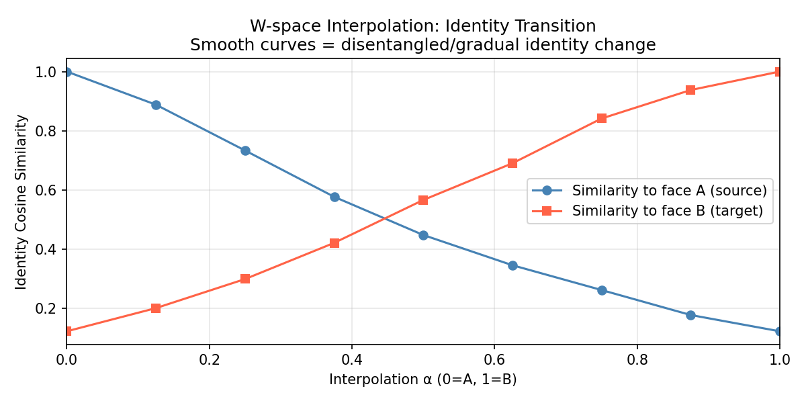

# StyleGAN2 W-Space Disentanglement Report

**Date:** 2026-04-07  
**Location:** /mnt/data0/naimul/StyleGAN2/  
**Checkpoint:** FFHQ StyleGAN2-ADA (pretrained)

---

## Abstract

This report evaluates whether StyleGAN2's intermediate latent space $\mathcal{W}$ is sufficiently disentangled for identity-preserving face swapping without additional training. Four experiments are run: (1) PCA structure of $\mathcal{W}$, (2) linear identity subspace discovery, (3) W+ layer-swap benchmarking, and (4) quantitative disentanglement metrics (identity consistency, layer ablation, interpolation). Key findings: identity consistency is high (ICS $= 0.9815 \pm 0.0063$), the identity subspace is compact (90% energy in 36 directions), and layer swapping achieves strong identity transfer (best score at $k=14$ with ID-Ret $= 0.998$ and ID-Leak $= 0.167$). A more attribute-preserving operating point is $k=9$ with ID-Ret $= 0.927$ and LPIPS $= 0.496$.

---

## 1. Background

StyleGAN2 maps $\mathbf{z} \sim \mathcal{N}(\mathbf{0}, \mathbf{I})$ to an intermediate latent code:

$$
\mathbf{w} = f(\mathbf{z}), \quad \mathbf{w} \in \mathbb{R}^{512}
$$

The synthesis network consumes $\mathcal{W}^+$:

$$
\mathbf{x} = g(\mathbf{W}^+), \quad \mathbf{W}^+ = [\mathbf{w}_0, \ldots, \mathbf{w}_{17}] \in \mathbb{R}^{18 \times 512}
$$

Empirically, layers 0-3 encode coarse pose and shape, layers 4-7 encode mid-level facial structure, and layers 8-17 encode fine texture and color.

---

## 2. Method Summary

### 2.1 PCA of $\mathcal{W}$

We sample $N=5000$ W codes and run PCA on layer-0 vectors. The traversal for component $k$ is:

$$
\mathbf{w}_\alpha = \bar{\mathbf{w}} + \alpha \cdot \sigma_k \cdot \mathbf{v}_k, \quad \alpha \in [-3, 3]
$$

### 2.2 Identity Subspace (Ridge + SVD)

A ridge regression maps W to identity embeddings $\mathbf{e}$:

$$
\hat{\mathbf{E}} = \mathbf{W}_0 \mathbf{B}^\top, \quad \mathbf{B} = \arg\min_{\mathbf{B}} \|\mathbf{E} - \mathbf{W}_0 \mathbf{B}^\top\|_F^2 + \lambda \|\mathbf{B}\|_F^2
$$

SVD on $\mathbf{B}$ provides identity directions; cumulative energy

$$
\rho(d) = \frac{\sum_{k=1}^d \sigma_k^2}{\sum_{k=1}^{512} \sigma_k^2}
$$

is used to estimate intrinsic identity dimensionality.

### 2.3 Layer Swap Benchmark

For split $k$:

$$
\mathbf{W}^+_{\text{swap}}(k) = [\mathbf{w}_{s,0}, \ldots, \mathbf{w}_{s,k-1}, \mathbf{w}_{t,k}, \ldots, \mathbf{w}_{t,17}]
$$

Metrics:

$$
\text{ID-Ret}(k) = \frac{1}{N} \sum_i \cos(\phi(\mathbf{x}_{\text{swap},i}), \phi(\mathbf{x}_{s,i}))
$$

$$
\text{ID-Leak}(k) = \frac{1}{N} \sum_i \cos(\phi(\mathbf{x}_{\text{swap},i}), \phi(\mathbf{x}_{t,i}))
$$

$$
\text{Score}(k) = \text{ID-Ret}(k) - \text{ID-Leak}(k)
$$

### 2.4 Quantitative Disentanglement

Identity Consistency Score (ICS):

$$
\text{ICS} = \frac{1}{M} \sum_{m=1}^M \frac{2}{n(n-1)} \sum_{a<b} \cos(\phi(\mathbf{x}_m^{(a)}), \phi(\mathbf{x}_m^{(b)}))
$$

Layer ablation for layer $\ell$:

$$
\Delta_\ell = \cos(\phi(g(\mathbf{W}^+)), \phi(g(\mathbf{W}^+_{[\ell \leftarrow \bar{\mathbf{w}}_\ell]})))
$$

W-space interpolation:

$$
\mathbf{W}^+(\alpha) = (1-\alpha)\mathbf{W}^+_A + \alpha \mathbf{W}^+_B
$$

---

## 3. Results

### 3.1 PCA Structure

- Top-1 PC: 6.8% variance
- Top-5 PCs: 27.6% variance
- Top-20 PCs: 58.2% variance
- Top-50 PCs: 71.9% variance

### 3.2 Identity Subspace

- Ridge $R^2 = 0.563$
- 80% energy: $d = 28$
- 90% energy: $d = 36$
- 99% energy: $d = 47$
- Largest spectral gap at $d \approx 49$ (ratio 30.6x)

### 3.3 Layer Swap Benchmark

| Split k | Layers from source | ID-Ret | ID-Leak | LPIPS | Score |
|---|---|---|---|---|---|
| 1 | [0] | 0.155 | 0.902 | 0.181 | -0.747 |
| 2 | [0-1] | 0.171 | 0.840 | 0.269 | -0.669 |
| 3 | [0-2] | 0.231 | 0.696 | 0.354 | -0.465 |
| 4 | [0-3] | 0.276 | 0.620 | 0.400 | -0.344 |
| 5 | [0-4] | 0.415 | 0.462 | 0.443 | -0.047 |
| 6 | [0-5] | 0.509 | 0.376 | 0.453 | 0.133 |
| 7 | [0-6] | 0.686 | 0.262 | 0.470 | 0.424 |
| 8 | [0-7] | 0.732 | 0.248 | 0.475 | 0.484 |
| 9 | [0-8] | 0.927 | 0.184 | 0.496 | 0.744 |
| 10 | [0-9] | 0.970 | 0.164 | 0.502 | 0.805 |
| 11 | [0-10] | 0.983 | 0.168 | 0.509 | 0.815 |
| 12 | [0-11] | 0.990 | 0.168 | 0.511 | 0.822 |
| 13 | [0-12] | 0.995 | 0.167 | 0.514 | 0.828 |
| 14 | [0-13] | 0.998 | 0.167 | 0.517 | 0.831 |
| 15 | [0-14] | 0.999 | 0.169 | 0.518 | 0.830 |
| 16 | [0-15] | 1.000 | 0.171 | 0.520 | 0.829 |
| 17 | [0-16] | 1.000 | 0.170 | 0.520 | 0.829 |
| 18 | [0-17] | 1.000 | 0.171 | 0.521 | 0.829 |

**Baseline** (source vs target, no swap): ID sim = 0.171

**Operating points:**
- Best overall score: $k=14$ with ID-Ret 0.998 and ID-Leak 0.167
- Attribute-preserving swap: $k=9$ with ID-Ret 0.927 and LPIPS 0.496

### 3.4 Quantitative Disentanglement

$$\text{ICS} = 0.9815 \pm 0.0063$$

Most identity-critical layers: 2, 4, 6, 8.

Crossover at $\alpha = 0.50$ indicates a symmetric identity transition.

---

## 4. Summary

- $\mathcal{W}$ is structured but not fully disentangled; top-50 PCs explain 71.9% variance.
- Identity is compact in $\mathcal{W}$: 90% energy in 36 directions (about 7.0% of 512 dims).
- Layer swapping is effective; best score at $k=14$ while $k=9$ trades some identity for attributes.
- High ICS confirms identity is stable in $\mathcal{W}$ rather than noise.
- Interpolation curves cross at $\alpha=0.5$, supporting symmetric identity geometry.
