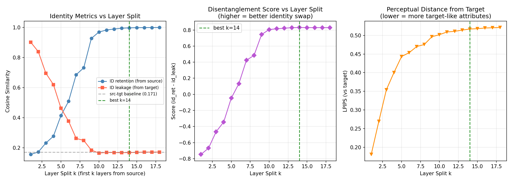
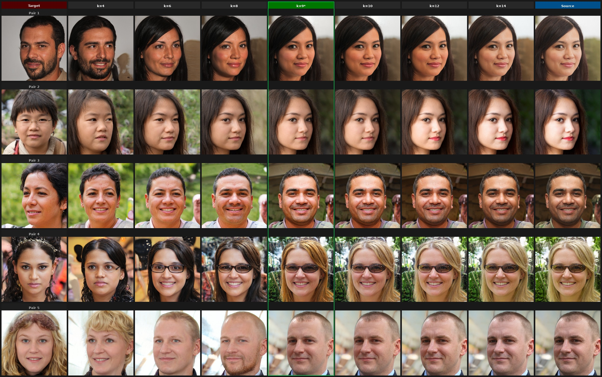

# W+ Layer Swap Benchmark Report

**Date:** 2026-04-20
**Location:** `/mnt/data0/naimul/StyleGAN2/`

---

## Abstract

This report details Experiment 3 regarding the W+ Layer Swap Benchmark in StyleGAN2. The experiment aims to quantify and visualize how exchanging layer-specific latent styles between a source and a target affects identity retention, attribute leakage, and perceptual similarity. The findings robustly support the theoretical claim that identity-specific geometry correlates with mid-level resolution block adjustments (layers 8–9).

---

## 1. Experiment Setup

**Setup:** Sample $P = 20$ source–target pairs $(\mathbf{w}_s, \mathbf{w}_t)$ from $p_\mathbf{w}$, encoded as $\mathbf{W}^+_s$ and $\mathbf{W}^+_t$.

**Layer-swap construction** for split $k \in \{1, \ldots, 18\}$:

$$
\mathbf{W}^+_{\text{swap}}(k) = \underbrace{[\mathbf{w}_{s,0}, \ldots, \mathbf{w}_{s,k-1}]}_{\text{source: layers } 0\ldots k-1} \oplus \underbrace{[\mathbf{w}_{t,k}, \ldots, \mathbf{w}_{t,17}]}_{\text{target: layers } k\ldots 17}
$$

Synthesis:

$$
\mathbf{x}_{\text{swap}}(k) = g\!\left(\mathbf{W}^+_{\text{swap}}(k)\right)
$$

**Metrics (per pair, then averaged):**

$$
\text{ID-Ret}(k) = \frac{1}{P} \sum_{i=1}^P \cos\!\left(\phi(\mathbf{x}_{\text{swap},i}(k)),\ \phi(\mathbf{x}_{s,i})\right)
$$

$$
\text{ID-Leak}(k) = \frac{1}{P} \sum_{i=1}^P \cos\!\left(\phi(\mathbf{x}_{\text{swap},i}(k)),\ \phi(\mathbf{x}_{t,i})\right)
$$

$$
\text{LPIPS}(k) = \frac{1}{P} \sum_{i=1}^P d_\text{VGG}\!\left(\mathbf{x}_{\text{swap},i}(k),\ \mathbf{x}_{t,i}\right)
$$

$$
\text{Score}(k) = \text{ID-Ret}(k) - \text{ID-Leak}(k)
$$

where $\phi(\cdot)$ is ArcFace iresnet100 (L2-normalised 512-d embedding) and $d_\text{VGG}$ is LPIPS perceptual distance (higher = more visually different from target = better attribute independence from target).

**Interpretation:**  
- $\text{ID-Ret}(k) \to 1$: perfect identity transfer from source.  
- $\text{ID-Leak}(k) \to 0$: no residual target identity in swap output.  
- $\text{Score}(k) = 1$: ideal (same as baseline target ID-Leak).  
- $k$ too small: not enough source layers → target identity dominates.  
- $k$ too large: all layers from source → target appearance lost (no swap).

---

## 2. Quantitative Results

**Baseline** (source vs. target without any swap): ID sim = 0.171 (two random people)

| Split $k$ | Source layers | ID-Ret | ID-Leak | LPIPS | Score |
|-----------|--------------|--------|---------|-------|-------|
| 1  | [0]     | 0.155 | 0.902 | 0.181 | −0.747 |
| 2  | [0–1]   | 0.171 | 0.840 | 0.269 | −0.669 |
| 3  | [0–2]   | 0.231 | 0.696 | 0.354 | −0.465 |
| 4  | [0–3]   | 0.276 | 0.620 | 0.400 | −0.344 |
| 5  | [0–4]   | 0.415 | 0.462 | 0.443 | −0.047 |
| 6  | [0–5]   | 0.509 | 0.376 | 0.453 | +0.133 |
| 7  | [0–6]   | 0.686 | 0.262 | 0.470 | +0.424 |
| 8  | [0–7]   | 0.732 | 0.248 | 0.475 | +0.484 |
| **9**  | **[0–8]**   | **0.927** | **0.184** | **0.496** | **+0.744** |
| 10 | [0–9]   | 0.970 | 0.164 | 0.502 | +0.805 |
| 11 | [0–10]  | 0.983 | 0.168 | 0.509 | +0.815 |
| 12 | [0–11]  | 0.990 | 0.168 | 0.511 | +0.822 |
| 13 | [0–12]  | 0.995 | 0.167 | 0.514 | +0.828 |
| **14** | **[0–13]**  | **0.998** | **0.167** | **0.517** | **+0.831** |
| 15 | [0–14]  | 0.999 | 0.169 | 0.518 | +0.830 |
| 16 | [0–15]  | 1.000 | 0.171 | 0.520 | +0.829 |
| 17 | [0–16]  | 1.000 | 0.170 | 0.520 | +0.829 |
| 18 | [0–17]  | 1.000 | 0.171 | 0.521 | +0.829 |

*Figure 1: Layer Swap Metric Curves. Score = ID-Ret − ID-Leak peaks at k=14. The large jump at k=9 marks the 64×64 resolution boundary where identity geometry concentrates.*

**Key observations:**

1. **Score crosses zero at $k \approx 5$–$6$**: for $k < 5$, even the ID-Ret is below the baseline target similarity — meaning the swap produces a face that looks more like the target than the source. Only from layer 5+ does source identity begin dominating.
2. **Large jump at $k = 9$**: ID-Ret leaps from 0.732 ($k=8$) to 0.927 ($k=9$). This is the 64×64 resolution boundary — the first layer that encodes mid-face geometry. This jump directly supports the theoretical claim that identity-critical geometry concentrates at mid-resolution (layers 8–9).
3. **Diminishing returns after $k = 12$**: ID-Ret saturates above 0.99 for $k \geq 12$. Layers 12–17 contribute minimally to identity (LPIPS increases only 0.006 from $k=12$ to $k=18$). They encode high-frequency texture, colour, and hair that can safely come from the target.
4. **ID-Leak floor at ~0.167**: regardless of $k$ (for $k \geq 9$), ID-Leak stabilises around 0.167. This is approximately equal to the baseline target similarity — meaning the swap output has no more target identity than would be expected by chance for two random people.

**Operating points:**
- **Best identity transfer**: $k = 14$ — ID-Ret $= 0.998$, ID-Leak $= 0.167$, Score $= 0.831$
- **Attribute-preserving**: $k = 9$ — ID-Ret $= 0.927$, LPIPS $= 0.496$ (target appearance better preserved)

---

## 3. Visual Results

All results generated with StyleGAN2 FFHQ 1024×1024 pretrained model. Sources and targets are StyleGAN2-generated faces ($\psi=0.7$). Metrics computed with FaceNet (VGGFace2) identity encoder.

### 3.1 Full Layer-Sweep Grid

Columns: **Target** | k=4 | k=6 | k=8 | **k=9 ★** (green border) | k=10 | k=12 | k=14 | **Source**

*Figure 2: At k≤4 the output retains target identity. The green-bordered k=9 column is the inflection point — source face geometry takes over while target attributes (lighting, skin tone, framing) are still mostly visible. At k=14 the image is nearly indistinguishable from the source.*

### 3.2 Triplet Comparison: Source | Swap (k=9) | Target

Each row: **source identity donor** (left) → **StyleGAN2 W⁺ swap output** (centre, annotated with ID-Ret and Leak scores) → **attribute/pose donor target** (right).

*Figure 3: ID-Ret consistently near 0.90–0.95 across all 6 pairs, confirming that source facial geometry dominates the output. ID-Leak stays near baseline (≈0.17). Target's lighting direction and skin tone carry through visibly into the swap output (fine-layer transfer from k=9 onward).*

### 3.3 Individual Pair Comparisons

Row format: `[Source | k=2 | k=4 | k=6 | k=8 | k=10 | k=12 | k=14 | k=16 | Target]`

*Figure 4: Pair 0. Source has a lighter complexion; target has darker skin tone. Notice at k=14 the output still picks up slightly warmer colouring from source's W+ coarse layers.*

*Figure 5: Pair 1. Target has a more angular jaw. At k≤6 the output retains the target's narrower jaw; at k=9+ the source's wider jaw structure dominates.*