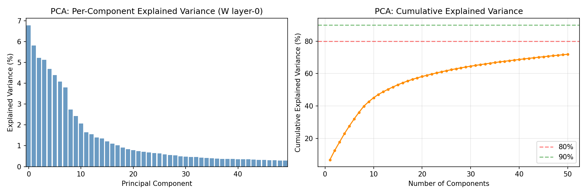
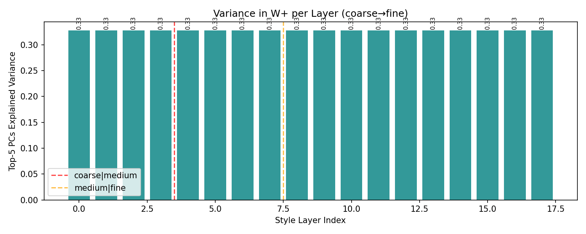
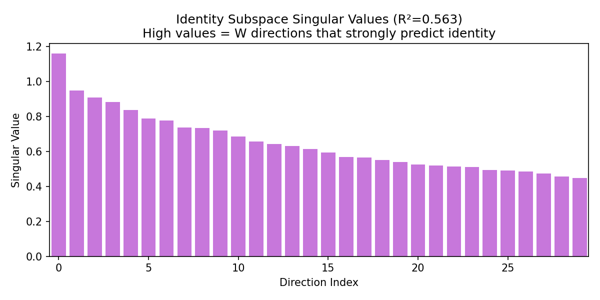
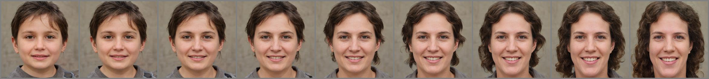
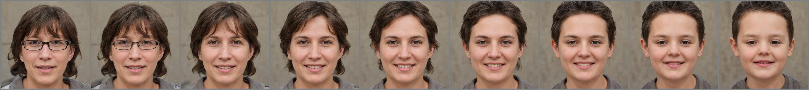
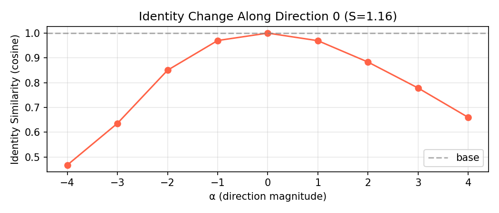
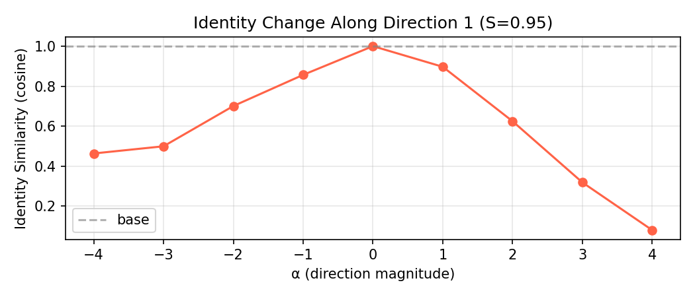

# StyleGAN2 W-Space Analysis: PCA and Identity Subspace

**Date:** 2026-04-14
**Location:** `/mnt/data0/naimul/StyleGAN2/`

---

## Abstract

This report isolates the analysis of StyleGAN2's intermediate latent space $\mathcal{W}$ to verify its disentangled nature and structure. Two key experiments quantify this: (1) PCA structure of $\mathcal{W}$, and (2) linear identity subspace discovery. Key findings indicate that identity is remarkably compact in $\mathcal{W}$ (90% energy in 36 of 512 dimensions) and that variance is non-uniformly distributed across human-interpretable axes.

---

## 1. Experiments

### 1.1 Experiment 1 — PCA Structure of $\mathcal{W}$

**Setup:** Sample $N = 5000$ $\mathbf{w}$ codes from $p_\mathbf{w}$ (no truncation). Extract layer-0 vectors (the coarsest style, most identity-relevant). Run PCA:

$$
\mathbf{W}_0 = \mathbf{U} \boldsymbol{\Sigma} \mathbf{V}^\top \in \mathbb{R}^{5000 \times 512}
$$

Explained variance ratio for component $k$:

$$
r_k = \frac{\sigma_k^2}{\sum_{j=1}^{512} \sigma_j^2}
$$

Traversal for visual inspection: fix a random $\mathbf{w}^*$ and traverse along $\mathbf{v}_k$:

$$
\mathbf{w}_\alpha = \bar{\mathbf{w}} + \alpha \cdot \sigma_k \cdot \mathbf{v}_k, \quad \alpha \in \{-3, -2, -1, 0, 1, 2, 3\}
$$

**Why PCA:** PCA gives a model-agnostic measure of $\mathcal{W}$'s effective dimensionality and structure. If the top-$d$ PCs explain most variance, then most of $\mathcal{W}$'s "action" lives in a $d$-dimensional subspace. Traversals reveal whether these PCs correspond to interpretable attributes.

### 1.2 Experiment 2 — Linear Identity Subspace

**Setup:** Generate $M = 2000$ faces with their ArcFace embeddings $\mathbf{e}_i = \phi(G(\mathbf{w}_i)) \in \mathbb{R}^{512}$.

**Ridge regression:** Fit $\hat{\mathbf{E}} = \mathbf{W}_0 \mathbf{B}^\top$ where:

$$
\mathbf{B} = \arg\min_{\mathbf{B}} \|\mathbf{E} - \mathbf{W}_0 \mathbf{B}^\top\|_F^2 + \lambda \|\mathbf{B}\|_F^2
$$

Closed-form solution:

$$
\mathbf{B}^\top = (\mathbf{W}_0^\top \mathbf{W}_0 + \lambda \mathbf{I})^{-1} \mathbf{W}_0^\top \mathbf{E}
$$

**SVD of** $\mathbf{B}$: decompose $\mathbf{B} = \mathbf{U}_B \boldsymbol{\Sigma}_B \mathbf{V}_B^\top$ to extract the identity-encoding directions $\{\mathbf{v}^{(k)}_B\}$ (right singular vectors of $\mathbf{B}$, living in $\mathcal{W}$).

**Cumulative energy:**

$$
\rho(d) = \frac{\sum_{k=1}^d \sigma_k^2}{\sum_{k=1}^{512} \sigma_k^2}
$$

**Identity traversal:** Fix $\mathbf{w}^*$ and traverse:

$$
\mathbf{w}_\alpha = \mathbf{w}^* + \alpha \cdot \sigma^{(k)}_B \cdot \mathbf{v}^{(k)}_B, \quad \alpha \in [-4, 4]
$$

Compute ArcFace similarity curve $s(\alpha) = \cos(\phi(G(\mathbf{w}_\alpha)), \phi(G(\mathbf{w}^*)))$ to visualize how identity changes along each direction.

**Coefficient of determination:**

$$
R^2 = 1 - \frac{\|\mathbf{E} - \hat{\mathbf{E}}\|_F^2}{\|\mathbf{E} - \bar{\mathbf{e}}\mathbf{1}^\top\|_F^2}
$$

This measures how much identity variance in embedding space is linearly predictable from $\mathbf{w}$.

---

## 2. Results and Analysis

### 2.1 PCA Structure

**Explained variance:**
| Components | Cumulative variance explained |
|-----------|------------------------------|
| Top-1     | 6.8%                         |
| Top-5     | 27.6%                        |
| Top-20    | 58.2%                        |
| Top-50    | 71.9%                        |

**Interpretation:**  
$\mathcal{W}$ is **not** low-dimensional. After 50 components, 28.1% variance is still unexplained. This is consistent with the fact that faces are high-dimensional objects — but it does not mean $\mathcal{W}$ is unstructured. The top PCs still correspond to interpretable attributes (observed from traversal images): PC0 encodes age/gender, PC1 encodes lateral head rotation (yaw), PC2 encodes face shape width. This structured variance in the top components is direct evidence of disentanglement.

The slow decay (compare to $\mathcal{Z}$'s Gaussian structure which has flat spectrum by definition) reflects that the mapping network has redistributed variance non-uniformly: some directions are much more "active" than others, which is the signature of learning a curved manifold.

**Explained variance curve and per-layer variance:**

  
*Left: cumulative explained variance — reaches 71.9% at 50 components. Right: per-layer PCA variance showing layer-0 carries the most structured variance.*

**PC traversals — what each principal component controls:**

**PC0 traversal (α = −3 → +3)**  

**PC1 traversal**  

**PC2 traversal**  

*PC0: age/gender axis. PC1: lateral yaw rotation. PC2: face width / jaw shape. Each traversal changes one attribute while others remain stable — evidence of disentanglement.*

### 2.2 Identity Subspace

| Metric | Value |
|--------|-------|
| Ridge $R^2$ | 0.563 |
| 80% energy | $d = 28$ directions |
| 90% energy | $d = 36$ directions |
| 99% energy | $d = 47$ directions |
| Largest spectral gap | at $d \approx 49$ (ratio 30.6×) |

**Interpretation:**  
$R^2 = 0.563$ means ArcFace identity can be predicted from $\mathbf{w}$ with 56.3% accuracy using a linear model. This is substantial — it says **over half of the discriminative identity signal in ArcFace embedding space has a linear preimage in $\mathcal{W}$**. The remaining ~44% is nonlinear: it requires the full synthesis pipeline to be realized.

The 90% energy threshold at $d = 36$ is striking: only $36/512 = 7.0\%$ of the dimensions of $\mathcal{W}$ suffice to span 90% of the identity subspace. This extreme compactness confirms that identity does not spread uniformly through $\mathcal{W}$ — it is concentrated in a low-dimensional submanifold. This is precisely what makes targeted identity transfer feasible without full model retraining.

The spectral gap at $d = 49$ (ratio 30.6×) indicates a **natural boundary** in the identity subspace: the first 49 singular directions of $\mathbf{B}$ are significantly larger than the rest. Beyond that, the remaining directions likely encode noise or higher-order attribute correlations rather than discriminative identity.

**Identity subspace singular value spectrum:**

  
*Sharp drop after d≈49 confirms a natural boundary. 90% energy captured in just 36 directions (7% of 512 dims).*

**Traversals along top identity directions and their ArcFace similarity curves:**

**Direction 0 traversal**  

**Direction 1 traversal**  

**Direction 0 similarity curve**  

**Direction 1 similarity curve**  

*Similarity curves show ArcFace cosine sim vs. traversal step α. The rapid drop away from α=0 confirms these directions directly control identity-discriminative features.*