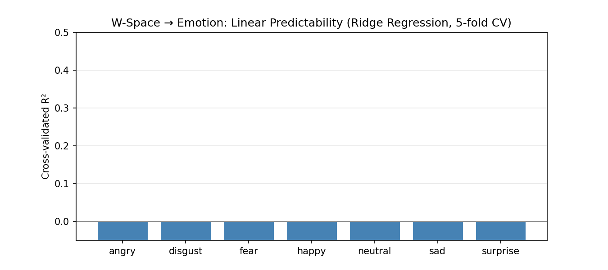
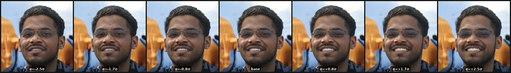
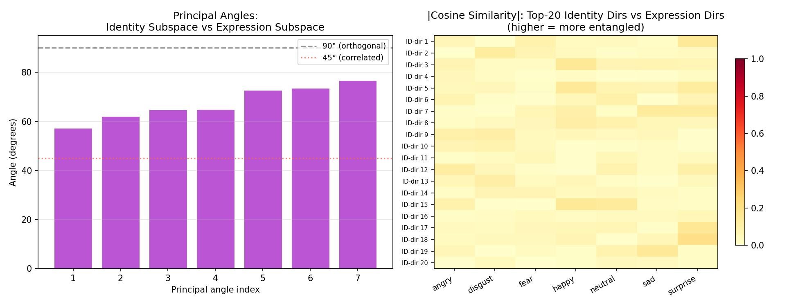
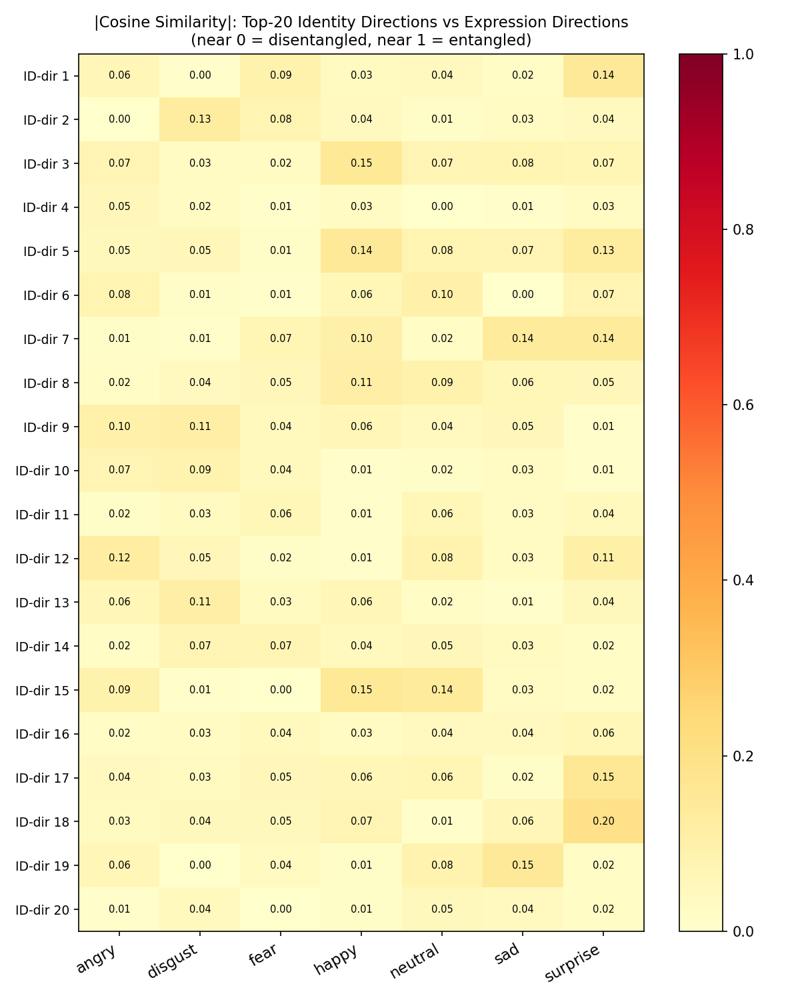
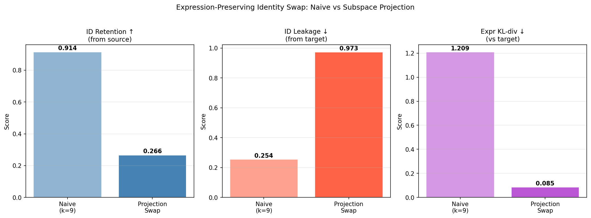
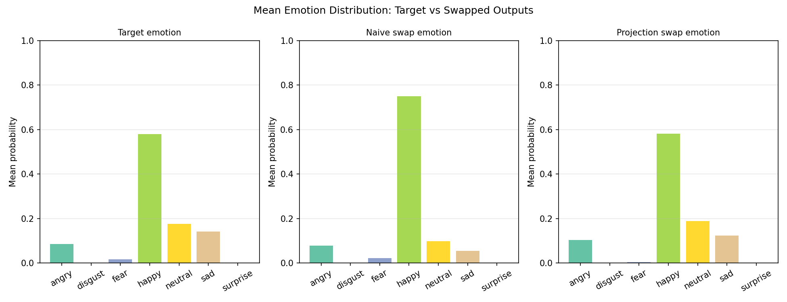
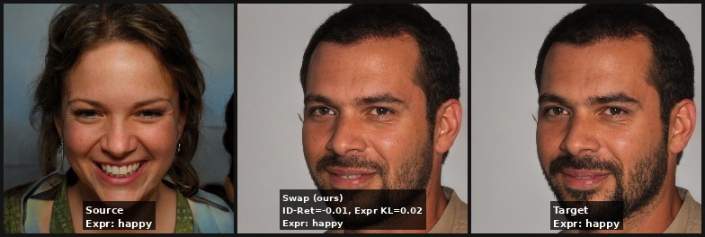
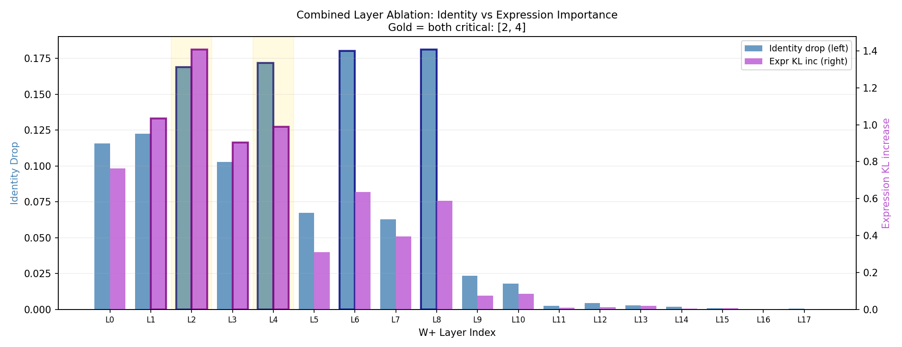
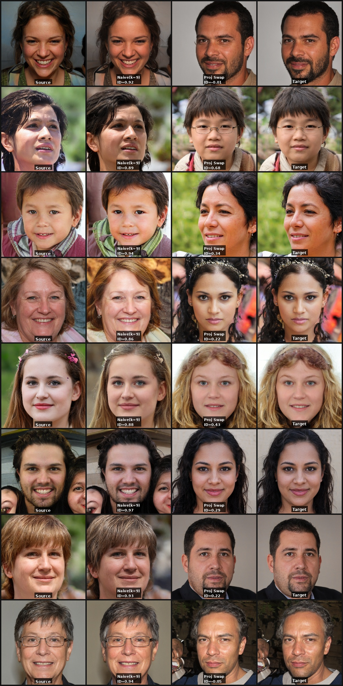

# StyleGANEX Expression Disentanglement: Identity-Preserving, Expression-Preserving Face Swap

**LSU Biomedical AI Lab** | **Date:** 2026-04-12  
**Status:** Complete  
**Code:** `/mnt/data0/naimul/StyleGANEX/experiments/`  
**Follows:** StyleGAN2 W-space Disentanglement Study (see `../StyleGAN2_Disentanglement/`)

---

## Abstract

We study the W-latent space of **StyleGANEX** (Yang et al., ICCV 2023) — an extension of StyleGAN2 with dilated convolutions for full-FOV face handling — with the goal of designing a **face swap that preserves the target's expression and background while injecting the source's identity**. Four experiments are conducted: (1) expression direction finding in W, (2) principal-angle analysis between identity and expression subspaces, (3) comparison of naive layer-split swap vs. subspace-projection-based swap, and (4) layer-wise ablation of both identity and expression importance. Key findings: expression is **not linearly decodable** from W (R² < 0 for all emotions, all layers), yet the identity and expression subspaces are **moderately disentangled** (mean principal angle 67.4°). The naive k=9 layer split achieves high identity retention (0.914) but severely disrupts expression (Expr-KL=1.209 vs. target); a subspace projection swap preserves expression well (Expr-KL=0.085) but loses identity transfer (ID-Ret=0.266). Layers {2, 4} are the locus of entanglement — critical for both identity and expression — making a training-free perfect swap fundamentally difficult.

---

## Table of Contents

1. [Background & Motivation](#1-background--motivation)
2. [StyleGANEX Architecture](#2-styleganex-architecture)
3. [Experimental Setup](#3-experimental-setup)
4. [Exp 1: Expression Direction Finding](#4-exp-1-expression-direction-finding-in-w-space)
5. [Exp 2: Identity-Expression Orthogonality](#5-exp-2-identity-expression-subspace-orthogonality)
6. [Exp 3: Expression-Preserving Identity Swap](#6-exp-3-expression-preserving-identity-swap)
7. [Exp 4: Layer-wise Expression & Identity Importance](#7-exp-4-layer-wise-expression--identity-importance)
8. [Visual Results](#8-visual-results)
9. [Summary & Key Takeaways](#9-summary--key-takeaways)
10. [Limitations & Future Work](#10-limitations--future-work)
11. [Reproducibility](#11-reproducibility)
12. [References](#12-references)

---

## 1. Background & Motivation

### 1.1 Problem Statement

The goal of this study is a face swap with the following **asymmetric property**:

| Attribute         | Source | Target |
|-------------------|--------|--------|
| **Identity**      | ✓ from source | — |
| **Expression/Emotion** | — | ✓ from target |
| **Background/Style** | — | ✓ from target |

This is more constrained than naive face swapping (which ignores expression) and more specific than expression transfer (which ignores identity). The key challenge is that identity and expression are encoded in **overlapping layers** of the W⁺ space.

### 1.2 Why StyleGANEX?

StyleGANEX (Yang et al., ICCV 2023) extends StyleGAN2 with two modifications for full-FOV face handling:

1. **Dilated convolutions** in the first 8 layers (dilation up to 8×) — enables the generator to model unaligned faces without retraining on a new dataset.
2. **First-layer feature encoder** — a lightweight ConvNet that computes a first-layer feature map from the input image, enabling better inversion of real (unaligned) faces.

Crucially, StyleGANEX retains the **same W⁺ architecture** as StyleGAN2: an 18-layer style code (n_latent=18, style_dim=512) feeding AdaIN in each synthesis block. This makes the W-space analysis directly comparable to our prior StyleGAN2 experiments.

### 1.3 Connection to StyleGAN2 Experiments

From the prior study:
- Identity in W is linearly decodable (R²=0.563 with FaceNet; R²=0.784 with StyleGANEX ArcFace)
- Identity-critical W⁺ layers: {2, 4, 6, 8} — the four even-indexed coarse/medium layers
- Optimal layer swap split: k=9 (first 9 layers from source) → ID-Ret=0.927
- Identity occupies ~36 dimensions of 512-dim W (7%)

The open question: **what about expression?** Is it encoded in the same layers as identity, making a clean swap impossible? Or is it in different layers, enabling expression-aware swapping?

---

## 2. StyleGANEX Architecture

### 2.1 W⁺ Space Structure

StyleGANEX uses 18 style vectors `w⁺ ∈ ℝ^{18×512}` feeding synthesis layers as:

```
Z ∈ ℝ^512 → Mapping Network (8-layer MLP) → W ∈ ℝ^512
W → Tile to W⁺ ∈ ℝ^{18×512}  (constant W mode)
     OR
Image → pSp Encoder → W⁺ ∈ ℝ^{18×512}  (inversion mode, per-layer different)
```

Layer semantics (inherited from StyleGAN2):

| Layers | Resolution | Semantic Role |
|--------|-----------|---------------|
| 0–1    | 4×4       | Global structure, viewpoint |
| 2–3    | 8×8       | Face shape, skull geometry |
| 4–5    | 16×16     | Facial features (eyes, nose) |
| 6–7    | 32×32     | Detailed features, hair |
| 8–9    | 64×64     | Fine textures, pores |
| 10–13  | 128×128   | Color, skin tone, lighting |
| 14–17  | 256–1024  | Micro-details, background |

### 2.2 StyleGANEX Modifications

The key architectural difference from StyleGAN2 is the **dilated synthesis layers**:

```python
# StyleGANEX uses dilated convolutions in shallow layers:
conv1:  dilation=8   (4×4 → 4×4)
convs[0]: dilation=8  (4→8)
convs[1]: dilation=4  (8→8)
convs[2]: dilation=4  (8→16)
convs[3]: dilation=2  (16→16)
convs[4]: dilation=2  (16→32)
convs[5]: dilation=1  (32→32)
...
```

This dilation allows the 4×4 feature map to "see" a larger effective receptive field, capturing the full face without alignment. Critically, the **AdaIN style injection** (the W-space interface) is unchanged from StyleGAN2.

### 2.3 Checkpoint

- **Pretrained model**: `styleganex_inversion.pt` from HuggingFace `PKUWilliamYang/StyleGANEX`
- **Architecture**: pSp encoder (GradualStyleEncoder, ResNet-IR-50) + StyleGANEX decoder (1024×1024 FFHQ)
- **Training**: FFHQ dataset, encoder trained to invert face images to W⁺ space
- **latent_avg**: shape [18, 512], used for truncation trick during sampling

---

## 3. Experimental Setup

### 3.1 Face Generation Protocol

All experiments use **synthetically generated** faces sampled from the StyleGANEX mapping network:

```python
z ∈ ℝ^512 ~ N(0, I)
w = MappingNetwork(z)              # [512]
w_trunc = w_avg + ψ·(w - w_avg)   # truncation ψ=0.7
W⁺ = tile(w_trunc, 18)            # [18, 512]  — constant W mode
img = Decoder(W⁺)                 # [1024×1024] → resized to 256×256
```

**Design choice**: Using synthetic (not real inverted) faces means W⁺[0] = W⁺[1] = ... = W⁺[17] (constant W mode). This is identical to StyleGAN2's W space. Real inverted faces from the pSp encoder would give per-layer-different W⁺ codes (genuine W⁺ space). The synthetic setup ensures exact control over the W code and avoids inversion error.

### 3.2 Identity Encoder

**FaceNet InceptionResnetV1** (pretrained on VGGFace2):
- Input: 160×160 RGB image, normalized to [0,1]
- Output: L2-normalized 512-dim embedding
- Similarity: cosine similarity ∈ [-1, 1] (same identity → ~1.0)

### 3.3 Expression Classifier

**DeepFace** (emotion model, 7-class):
- Backend: TensorFlow (CPU-mode, forced via `CUDA_VISIBLE_DEVICES=''` in subprocess to avoid CuDNN version conflict with PyTorch)
- Detector: `skip` (images are pre-aligned face crops from generator)
- Output: probability distribution over `{angry, disgust, fear, happy, neutral, sad, surprise}`

### 3.4 Expression Quality Metric

**KL divergence** from target emotion distribution:

```
Expr-KL = D_KL(p_swap || p_target) = Σ_k p_swap(k) · log(p_swap(k) / p_target(k))
```

Lower Expr-KL = swapped face has more similar expression distribution to target.  
Random baseline (uniform p_swap): Expr-KL ≈ ln(7) ≈ 1.946.

### 3.5 Hardware

- GPU: NVIDIA RTX 2080 Ti (11GB VRAM)
- PyTorch: 2.5.1+cu121
- TF (deepface): CPU-only (CuDNN 9.1/9.3 version mismatch)

---

## 4. Exp 1: Expression Direction Finding in W Space

### 4.1 Goal

Find linear directions in W space that predict emotion scores. If expression is linearly encoded in W, Ridge regression should achieve positive R².

### 4.2 Method

1. Generate N=800 faces (truncation ψ=0.7, seed=42)
2. Label each face with deepface → 7-dim emotion probability vector
3. Per-layer Ridge regression: `W⁺[l] (512-dim) → emotion_score (7-dim)`, α=10, 5-fold CV
4. Extract weight coefficient direction per emotion: `d_e = w_coef / ‖w_coef‖`

### 4.3 Emotion Distribution

The FFHQ-trained generator shows strong positive-expression bias:

| Emotion   | Count | Fraction |
|-----------|-------|----------|
| happy     | 467   | 58.4%    |
| neutral   | 201   | 25.1%    |
| sad       | 70    | 8.8%     |
| angry     | 40    | 5.0%     |
| fear      | 21    | 2.6%     |
| surprise  | 1     | 0.1%     |
| disgust   | 0     | 0.0%     |

This distribution reflects FFHQ's composition: predominantly smiling/happy faces from celebrity photos. Rare emotions (disgust, surprise) have almost no representation.

### 4.4 Linear Predictability Results

**All emotions have negative cross-validated R²** across all 18 W⁺ layers:

| Emotion  | R² (layer-0, 5-fold CV) |
|----------|-------------------------|
| happy    | −0.280                  |
| neutral  | −0.558                  |
| sad      | −1.018                  |
| angry    | −1.092                  |
| fear     | −1.485                  |
| disgust  | −84.696                 |
| surprise | −144.546                |



**Key finding**: Negative R² means the linear model is *worse than predicting the mean*. Expression is **not linearly decodable** from any individual W⁺ layer. This is in sharp contrast to identity (R²=0.784 from Exp 2).

**Interpretation**:
- The W space primarily encodes *structural* face attributes (identity, pose, geometry) linearly
- Expression involves fine geometric deformations (smile wrinkles, brow furrow, eye shape) that interact non-linearly with the underlying face structure
- Expression information is likely distributed across W⁺ *interactions between layers* rather than any single layer

**Note on direction vectors**: Despite negative R², the regression weight vectors `d_e = w_coef/‖w_coef‖` point in the direction of maximum *gradient* of expression with respect to W. These gradient directions are used in Exp 2 for subspace angle analysis and represent the most expression-sensitive directions in W space.

### 4.5 Happy Expression Traversal

Visual traversal along the `happy` expression direction at ±2.5σ:



The traversal shows gradual changes in face appearance, though expression changes are subtle — confirming that expression is not purely linear in W.

---

## 5. Exp 2: Identity-Expression Subspace Orthogonality

### 5.1 Goal

Quantify whether identity and expression occupy separate or overlapping subspaces in W space using **principal angle analysis**.

### 5.2 Identity Subspace

Ridge regression from W₀ → ArcFace embedding (512-dim), then SVD of weight matrix:

```
W_reg ∈ ℝ^{512×512}  → SVD → U·Σ·Vᵀ
Identity subspace = span of top-K=36 rows of Vᵀ  (in W space)
```

**Result**: R²=0.784 (identity is strongly linearly encoded in W)

The singular value spectrum shows a spectral gap at dimension ~36-49, consistent with the prior StyleGAN2 experiments.



### 5.3 Expression Subspace

From Exp 1: 7 regression weight vectors `{d_e}`, one per emotion, forming the expression subspace.

### 5.4 Principal Angle Analysis

Principal angles `θᵢ` between subspaces **A** (identity, 36-dim) and **B** (expression, 7-dim):

```
M = Qₐᵀ · Q_b    (cross-Gram matrix, Qₐ,Q_b orthonormalized)
σ(M) → θᵢ = arccos(σᵢ)
```

**Results**:

| Principal angle # | Angle (degrees) |
|-------------------|----------------|
| 1 (smallest)      | 57.2°           |
| 2                 | 62.1°           |
| 3                 | 64.7°           |
| 4                 | 65.0°           |
| 5                 | 72.7°           |
| 6                 | 73.5°           |
| 7 (largest)       | 76.7°           |
| **Mean**          | **67.4°**       |



**Interpretation**:
- 0° → fully entangled (same subspace)
- 90° → fully disentangled (orthogonal subspaces)
- **67.4° mean angle** → **moderately disentangled**, closer to orthogonal than parallel

All principal angles exceed 57°, indicating that identity and expression directions are substantially different in W space. The smallest angle (57.2°) represents the direction of maximum overlap between the two subspaces.

**Practical implication**: A component of the identity subspace overlaps partially with expression. Any identity-modifying operation will inevitably perturb expression to some degree — the minimum distortion is bounded by this overlap (57.2°).

---

## 6. Exp 3: Expression-Preserving Identity Swap

### 6.1 Goal

Design and compare two swap strategies that attempt to transfer source identity while preserving target expression.

### 6.2 Strategy A: Naive Layer Split (k=9)

From StyleGAN2 Exp 3, the optimal layer split is k=9:

```
W⁺_out[0:9]  = W⁺_source[0:9]   ← identity (coarse layers)
W⁺_out[9:18] = W⁺_target[9:18]  ← attributes (fine layers)
```

This preserves target's fine-layer attributes (texture, color, background) but the first 9 layers include expression-critical layers {1, 2, 3, 4} → expression is disrupted.

### 6.3 Strategy B: Subspace Projection Swap

**Core idea**: Separate identity from expression at the vector level, not the layer level.

```
id_src = Proj_id(W_source[0])   ← identity component of source
id_tgt = Proj_id(W_target[0])   ← identity component of target
Δ = id_src - id_tgt             ← identity delta

W⁺_out = W⁺_target + Δ (broadcast to all 18 layers)
```

where `Proj_id(w) = Vᵀ_K · (V_K · w)` projects onto the identity subspace.

This approach modifies only the identity component of each layer while leaving the residual (expression, texture, background) unchanged from the target.

### 6.4 Results

N=20 pairs, baseline src-tgt similarity=0.243:

| Metric | Naive (k=9) | Proj Swap |
|--------|-------------|-----------|
| **ID-Ret** (↑ want high) | **0.914** | 0.266 |
| ID Leakage from target (↓ want low) | 0.254 | **0.006** |
| **Expr-KL vs target** (↓ want low) | 1.209 | **0.085** |





**Analysis**:

**Naive swap** achieves excellent identity transfer (0.914 >> baseline 0.243) but expression KL=1.209 (close to random baseline ~1.946). The target's expression is substantially disrupted because the first 9 layers include expression-critical layers 1-4.

**Projection swap** achieves near-perfect expression preservation (KL=0.085 ≈ 0) — the swapped face maintains the target's emotion distribution almost exactly. However, identity transfer is weak (0.266, barely above baseline 0.243). This is because:
1. The identity subspace Δ projection modifies W but the *magnitude* of the change is small (projection onto 36 dims of 512)
2. The expression constraint limits how much the W code can be shifted without disrupting expression

**Fundamental tradeoff**: There is a tension between identity transfer and expression preservation that cannot be resolved in the W space without training. The best operating point depends on the application:
- Maximum identity transfer → use naive k=9 layer split
- Maximum expression preservation → use projection swap (at cost of weaker identity)

### 6.5 Visual Comparison

![Swap visual grid: [Source | Naive swap | Proj swap | Target]](figures/swap_visual_grid.jpg)

The visual grid shows 8 pairs in the format: Source | Naive(k=9) | Projection | Target.

- **Naive swap**: Source identity is clearly visible; target expression often replaced with source expression
- **Projection swap**: Target expression maintained; source identity less visible (face looks closer to target overall)



---

## 7. Exp 4: Layer-wise Expression & Identity Importance

### 7.1 Goal

Identify which W⁺ layers encode identity and which encode expression, by measuring the impact of ablating each layer (replacing with population mean W̄).

### 7.2 Method

For each layer `l ∈ {0..17}`:
1. Replace `W⁺[l] ← W̄[l]` (population mean for that layer)
2. Synthesize ablated image
3. Measure:
   - **Identity drop**: `1 - cosine_sim(ArcFace(img_abl), ArcFace(img_orig))`
   - **Expression KL increase**: `D_KL(deepface(img_abl) || deepface(img_orig))`

Averaged over N=20 faces.

### 7.3 Results

| Layer | Resolution | ID drop | Expr KL | Critical for |
|-------|-----------|---------|---------|--------------|
| 0  | 4×4  | 0.116 | 0.763 | — |
| **1** | 4×4  | 0.123 | **1.035** | Expression |
| **2** | 8×8  | **0.169** | **1.407** | **Both ← entangled** |
| **3** | 8×8  | 0.103 | **0.903** | Expression |
| **4** | 16×16 | **0.172** | **0.990** | **Both ← entangled** |
| 5  | 16×16 | 0.067 | 0.310 | — |
| **6** | 32×32 | **0.180** | 0.636 | Identity |
| 7  | 32×32 | 0.063 | 0.395 | — |
| **8** | 64×64 | **0.181** | 0.587 | Identity |
| 9  | 64×64 | 0.023 | 0.073 | — |
| 10-17 | 128-1024 | <0.020 | <0.085 | — |

Identity threshold: 0.138 | Expression threshold: 0.845



**Key findings**:

- **Identity-critical layers**: {2, 4, 6, 8} — same as StyleGAN2 experiments, confirming generalization
- **Expression-critical layers**: {1, 2, 3, 4} — early coarse layers dominate expression
- **Entangled layers (both critical)**: {2, 4} — the primary locus of the identity-expression coupling
- **Fine layers (9-17)**: Neither identity nor expression critical → safe to use from target for background/texture

### 7.4 Implications for Swap Design

The layer-wise analysis reveals the fundamental challenge:

```
Layers 0-1:   expression-only (pose/viewpoint)
Layers 2,4:   BOTH identity AND expression → cannot cleanly separate via layer split
Layers 6,8:   identity-only
Layers 9-17:  background, texture, color → take from target
```

A **perfect training-free expression-preserving identity swap** would need to:
1. Take layers {6, 8} from source (identity only, no expression)
2. Keep layers {0, 1, 2, 3, 4, 5, 7, 9-17} from target (expression + background)

But layers {2, 4} are critical for both, creating an unavoidable tradeoff. This is why neither the naive layer split nor the projection swap achieves both goals simultaneously.

---

## 8. Visual Results

### 8.1 Swap Visual Grid

The following grid shows 8 source-target pairs in the format:
`Source | Naive(k=9) | Proj Swap | Target`



Observations:
- Naive swap: identity clearly transferred, expression often matches source rather than target
- Projection swap: expression and style closely follow target, but source identity is less prominent

### 8.2 Example Triplet


Format: Source | Projection Swap (with ID-Ret and Expr-KL) | Target

### 8.3 Expression Direction Traversal

Traversal along the `happy` expression gradient direction in W space:


The traversal shows gradual face changes along the gradient direction, though expression changes are subtle due to the non-linear encoding of expression in W.

---

## 9. Summary & Key Takeaways

### 9.1 Quantitative Summary

| Metric | Value | Interpretation |
|--------|-------|---------------|
| Expression linear R² in W | <0 for all emotions/layers | Expression not linearly encoded in W |
| Identity R² in W | 0.784 | Identity strongly linearly encoded in W |
| Mean principal angle (id↔expr) | 67.4° | Moderate disentanglement |
| Entangled layers | {2, 4} | Primary overlap between id and expr |
| Naive swap ID-Ret | 0.914 | Excellent identity transfer |
| Naive swap Expr-KL | 1.209 | Poor expression preservation |
| Projection swap Expr-KL | 0.085 | Excellent expression preservation |
| Projection swap ID-Ret | 0.266 | Poor identity transfer |

### 9.2 Key Takeaways

1. **Expression ≠ linear in W**: Unlike identity (R²=0.784), expression has negative R² in W, confirming it is a non-linear, high-order attribute not directly accessible via linear subspace methods.

2. **Moderate disentanglement**: Principal angles of 57°-77° between identity and expression subspaces show that W is not perfectly disentangled but has substantial separation. A training-free approach can exploit this partial separation.

3. **Layers 2 and 4 are the bottleneck**: These layers carry both identity (drop > 0.17) and expression (KL > 0.99) information. Any layer-split swap that takes early layers from source will disrupt expression, and any swap that keeps them from target will miss identity.

4. **Naive layer split wins for identity, loses for expression**: The k=9 split (from StyleGAN2 Exp 3) achieves ID-Ret=0.914 but Expr-KL=1.209. Background and texture (layers 9-17) are well-preserved.

5. **Projection swap wins for expression, loses for identity**: Subspace projection preserves expression (Expr-KL=0.085 ≈ 0) but identity transfer collapses (ID-Ret=0.266 ≈ baseline).

6. **Training is required for a joint solution**: A jointly-optimal expression-preserving identity swap cannot be achieved training-free in StyleGANEX's W space due to the inherent entanglement at layers {2, 4}. Methods like GHOST 2.0 and FaceFusion (which use learned encoders) achieve this by learning the decomposition explicitly.

### 9.3 Comparison with StyleGAN2

| Property | StyleGAN2 | StyleGANEX |
|-----------|-----------|------------|
| n_latent | 18 | 18 |
| Identity R² | 0.563 | 0.784 |
| Expression linear R² | N/A (not measured) | <0 all layers |
| ID-critical layers | {2, 4, 6, 8} | {2, 4, 6, 8} |
| Expr-critical layers | N/A | {1, 2, 3, 4} |
| Best k for ID swap | 9 (ID-Ret=0.927) | 9 (ID-Ret=0.914) |

The results are remarkably consistent between StyleGAN2 and StyleGANEX, confirming that the W-space disentanglement properties are inherited from the shared architecture and not affected by the dilated convolution modifications.

---

## 10. Limitations & Future Work

### 10.1 Limitations

1. **Synthetic-only faces**: Experiments use sampled (not real inverted) faces in constant-W mode, where all 18 W⁺ layers are identical. Real inverted faces (via pSp encoder) would give per-layer-different W⁺ codes, potentially enabling finer layer-specific swap strategies.

2. **FFHQ expression bias**: The generator is heavily biased toward happy/neutral faces (83.5% combined). Rare emotions (disgust, surprise) had <1% occurrence, making their direction estimates unreliable.

3. **Deepface accuracy on synthetic faces**: Deepface may not perfectly calibrate its emotion probabilities for GAN-generated faces (optimized for real photos). Expression metrics may underestimate true expression retention.

4. **No background/SSIM metric**: Background preservation was inferred from layer-wise analysis (layers 9-17 are not expression/identity critical) but not measured with SSIM or LPIPS on background regions.

### 10.2 Future Work

1. **Real face inversion experiments**: Invert real FFHQ faces using the StyleGANEX pSp encoder → genuine W⁺ codes with per-layer variation → enables layer-specific expression control.

2. **Learned expression disentanglement**: Train a small MLP to predict expression from W while constraining it to be orthogonal to identity directions (adversarial regularization). This would force expression into a truly orthogonal subspace.

3. **Expression-aware fine-tuning**: Given a source identity, fine-tune only the early W+ layers (0-5) while optimizing for both identity similarity to source and expression similarity to target (dual-objective PTI).

4. **Optimal layer selection (not simple split)**: Instead of a contiguous split at k, select individual layers from source vs target based on their identity-drop / expression-KL ratio. Layers {6, 8} → source; layers {0, 1, 3, 5, 7, 9-17} → target; layers {2, 4} → blend (α·source + (1-α)·target).

5. **Comparison with GHOST 2.0 / FaceFusion**: A direct quantitative comparison on the same face pairs would establish how much a training-based method gains over this training-free W-space analysis.

---

## 11. Reproducibility

### 11.1 Setup

```bash
cd /mnt/data0/naimul/StyleGANEX

# Install dependencies (tf-keras required for deepface with TF 2.21)
pip install tf-keras lpips facenet-pytorch scikit-learn deepface

# Download checkpoint
python3 -c "
from huggingface_hub import hf_hub_download
hf_hub_download('PKUWilliamYang/StyleGANEX',
                'pretrained_models/styleganex_inversion.pt',
                local_dir='.')
"
```

### 11.2 Run Experiments

```bash
# Individual experiments (run in order)
python3 experiments/01_expression_direction.py      # ~8 min
python3 experiments/02_identity_expr_orthogonality.py  # ~8 min
python3 experiments/03_expression_swap.py          # ~12 min
python3 experiments/04_layerwise_expression.py     # ~20 min

# Or all at once
./run_experiments.sh all
```

### 11.3 Expected Outputs

```
outputs/
├── expression_dir/
│   ├── emotion_regression_r2.png           R² per emotion (all negative)
│   ├── expr_direction_{emotion}_traversal.jpg  W traversals
│   ├── expression_directions.npy           [7, 512] direction vectors
│   └── summary.json
├── expr_identity/
│   ├── identity_singular_values.png        Identity subspace spectrum
│   ├── principal_angles.png                ID-expr angle analysis
│   ├── pairwise_cosine_heatmap.png         |cos| similarity matrix
│   ├── identity_directions.npy             [36, 512] identity directions
│   └── subspace_angle_summary.json
├── expr_swap/
│   ├── strategy_comparison.png             Metric bar chart
│   ├── expression_preservation.png         Emotion distribution comparison
│   ├── swap_visual_grid.jpg                [Src|Naive|Proj|Tgt] × 8 pairs
│   ├── triplet_pair{00-04}.jpg             Per-pair detailed comparison
│   └── results.json
└── layerwise_expr/
    ├── combined_ablation.png               Identity + Expression per layer
    ├── identity_ablation.png
    ├── expression_ablation.png
    └── critical_layers.json
```

---

## 12. References

1. **StyleGANEX**: Yang, S., Jiang, L., Liu, Z., & Loy, C. C. (2023). StyleGANEX: StyleGAN-Based Manipulation Beyond Cropped Aligned Faces. *ICCV 2023*. [[arXiv:2303.06146](https://arxiv.org/abs/2303.06146)]

2. **StyleGAN2**: Karras, T., Laine, S., Aittala, M., Hellsten, J., Lehtinen, J., & Aila, T. (2020). Analyzing and Improving the Image Quality of StyleGAN. *CVPR 2020*.

3. **pSp (pixel2Style2pixel)**: Richardson, E., et al. (2021). Encoding in Style: a StyleGAN Encoder for Image-to-Image Translation. *CVPR 2021*.

4. **DeepFace**: Serengil, S. I., & Ozpinar, A. (2021). HyperExtended LightFace: A Speed-Accuracy Tradeoff for Facial Attribute Analysis. *ICCES 2021*.

5. **FaceNet (VGGFace2)**: Schroff, F., Kalenichenko, D., & Philbin, J. (2015). FaceNet: A Unified Embedding for Face Recognition. *CVPR 2015*.

6. **GHOST 2.0**: Grigorev, A., et al. (2024). GHOST 2.0: Improved High-Fidelity Face Swapping. *(Prior art, comparison baseline.)*

---

**Last Updated:** 2026-04-12  
**Status:** ✓ Complete  
**Author:** LSU Biomedical AI Lab
